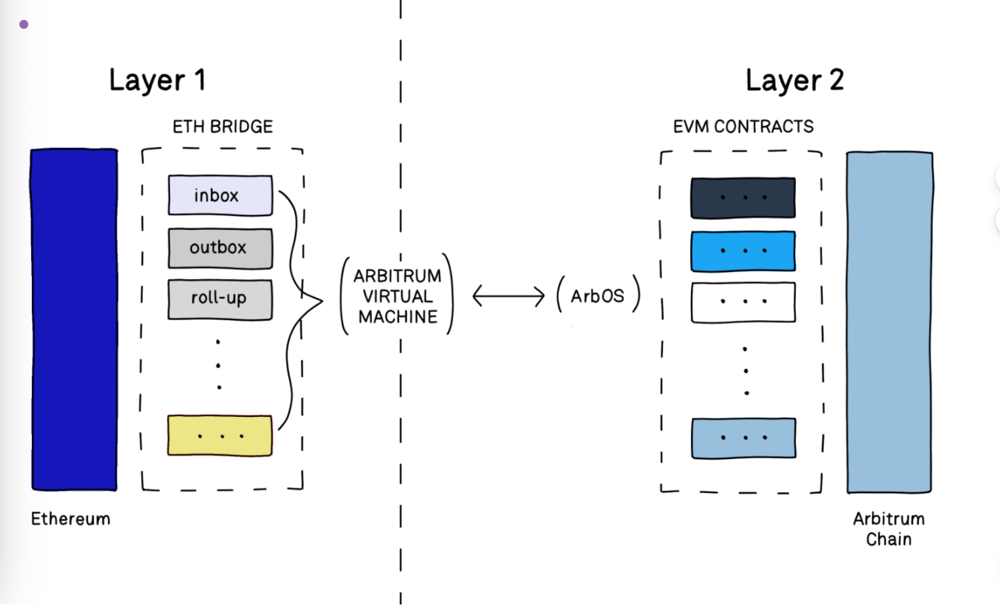
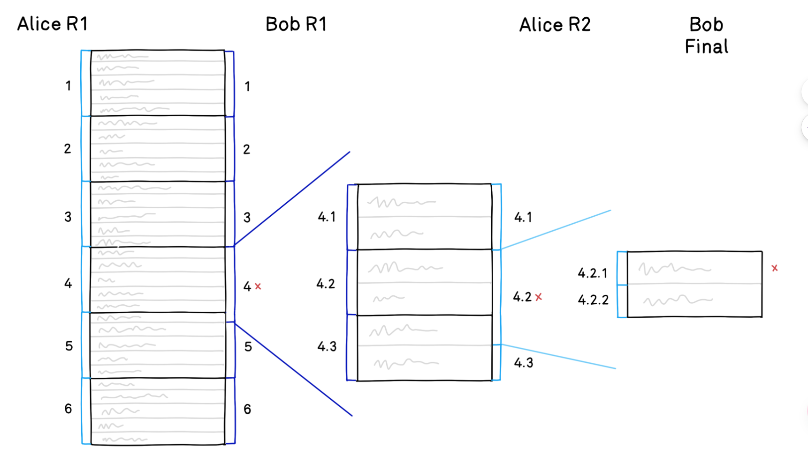
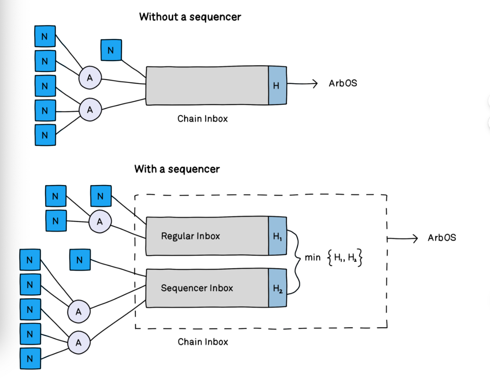

Arbitrum 是以太坊的第 2 层扩展解决方案。Tracer 将在下个月在Arbitrum上部署其永久掉期。以下阅读将让您全面了解 Arbitrum 的驱动机制，让您在 L2 环境中使用 Tracer 进行交易时更加舒适和理解。

### 一. 架构总结

- 由于 Arbitrum (L2) 作为以太坊 (L1) 的可扩展性解决方案而存在，因此 Arbitrum 架构自然部分存在于 L1 上，部分存在于 L2 上。
- 存在于 L1 上的 Arbitrum 组件是 EthBridge，它是一组以太坊合约。
- EthBridge 负责仲裁 Arbitrum Rollup 协议，以及维护链的收件箱和发件箱。
- 链的收件箱和发件箱允许用户、L1 合约和完整节点将他们的交易发送到链并观察这些交易的结果。
- Arbitrum 虚拟机是 L1 和 L2 之间的网关，由 EthBridge 提供的功能。
- AVM 能够读取输入并在这些输入上执行计算以产生输出。
- ArbOS 运行在 Arbitrum 虚拟机之上，负责确保智能合约在 Arbitrum 链上的执行。
- ArbOS 完全存在于 L2 上，并像在以太坊上运行一样运行 EVM 合约。

下图为Arbitrum 架构的高级视图

### 二. 汇总协议

- 链收件箱中消息的顺序决定了交易的结果。
	- 随后，任何正在查看收件箱的人都可以通过自动执行来了解交易的结果。
- Rollup 协议负责确认已经有效发生的事务的结果。
- 参与协议的用户称为验证者；如果验证者将 Eth 质押到存款合约中，他们就会成为质押者并可以质押 Rollup 链中的块。
	- 验证者和质押者的角色都是未经许可的。
- 在安全性方面，只需要一个诚实的验证者来强制链的正确执行。
	- 这使汇总链具有与以太坊主链相同程度的去信任性。
	- Arbitrum 假设存在至少一个诚实的验证者。
- Rollup 协议作用于 Rollup 链，它是与以太坊链分开存在的汇总块链。
- 验证者的角色是提议将新块添加到链中。
- 提议的每个区块最终都会被协议确认或拒绝。
- 每个区块由多个字段组成，除了区块编号字段之外，每个字段中给出的数据都是由区块提议者做出的断言，可能正确也可能不正确。
	- 如果任何断言的字段不正确，协议最终将拒绝该块。
- 一旦提出一个块，它就会收到确认的最后期限。
-  如果验证者不同意该区块，他们应该提出自己的正确区块，这会在诚实的验证者最终以不正确的区块获得欺诈证明时获得一些奖励。

### 三. 质押

- 为了让质押者向链中添加汇总块，他们必须将他们的质押放在他们正在添加的块上。
- 质押是无许可的，任何人都可以在任何可以质押的区块上质押。
- 一旦您被质押在一个区块上，在该区块被确认之前，您无法撤回您的质押。
- 当您质押一个区块时，您正在确认一个区块是正确的，并且链中最近确认的区块和您所质押的区块之间的每个区块都是正确的。
- 如果您质押的区块不正确，或者最近确认的区块与您质押的区块之间的链中的区块不正确，您将没收您的质押。
- 如果您没有在某个区块上质押，您可以在最近确认的区块上质押。
- 如果您被质押在一个汇总区块上，您可以将您的质押扩展到您所质押的区块的任何继任者。
- 质押所需的金额是动态的。
	- 在 Arbitrum 链中，有一个作为参数指定的基本质押量，大部分时间都会使用。
	- 作为一种安全措施，可以防止攻击者在失去权益的情况下减慢网络速度，因为第一个未解决节点的截止日期已过，权益金额乘以一个随时间呈指数增长的因子。
	- 这是为了在攻击期间增加这种攻击的成本。
	- 这种增加的权益是暂时的，并且仅在区块链确认区块进展缓慢时才会发生。

### 四.挑战协议

- 当两个质押者被质押在不同的区块上时，其中一个区块不是另一个区块的继承者，就会有一个他们不同意的特定区块，并且会发生挑战。
- 大多数挑战发生在 Arbitrum 链上，并由 L1 合约引用。
- 挑战包括在 L2 上进行的交互式多轮解剖游戏，以及在 L1 上执行的一步证明。
- 提出有争议的区块的质押者正在为他们的主张辩护，反对不同意的质押者。
- 防御方的质押者实质上声称，通过从前一个块开始，在虚拟机执行了一些 N 条指令之后，前一个块状态将被推进到他们提议的块中给定的状态。
- 防守方（Alice）将通过将 N 指令分解为大小为 N/K 的 K 个部分，在分解游戏中迈出第一步。
	- 请注意，子部分的大小在步数方面不相等，但在 Arbgas 消耗量方面大小相等。
	- 另请注意，每个段自然会有一个起点和一个终点（这很简单，但会使下一个点更容易理解）。
- 对方的质押者 (Bob) 也会将指令集分解为大小为 N/K 的 K 个部分，除了 Bob 的 K 个片段中的一个片段将具有与 Alice 的相应片段的端点不同的端点。
	- 这本质上是 Bob 识别他不同意的部分。
- 然后 Bob 将执行与 Alice 的初始步骤相同的操作，并将其中一个片段分解为大小为 N/K 的 K 个子片段，并将该片段与已识别的子片段一起发送回 Alice。
- 然后 Alice 执行与 Bob 的初始步骤相同的操作，并确定她不同意其端点的子段。
- 这个剖析过程一直持续到 Alice 和 Bob 确定了一条他们不同意的指令。
- 该指令被发送到 L1 合同，该合同执行它并决定争议的获胜者。
- 争议的失败者将被没收他们的股份，其中一部分将被烧毁 - 以避免攻击者对冲他们的赌注 - 其余的股份将作为奖励给予诚实的质押者。
- 在整个解剖过程中，裁判游戏的L1合约本身并不知道指令的任何信息，它只是检查每个玩家是否遵守解剖游戏的规则。
- 在争议期间，所有其他验证者都能够在争议最终确定之前自行确定争议结果；这意味着本质上会发生软分叉，并且验证者可以继续在正确的链上提交汇总块。
- 挑战期对每个质押者的时间限制约为一周。
- 每个质押者必须在他们的周分配内完成所有行动，否则他们将输掉这场争论。
	- 想想一个国际象棋时钟。
	

*两个质押者在挑战协议期间进行的多轮交互式解剖游戏的演示。实际上，有争议的断言将有更多的指令（​​其中带有波浪线的行），因此将进行更多轮次，但原理是相同的。*

### 五.验证器

- 验证者是 Arbitrum 链上的一个节点，它选择监视 Rollup 协议的活动并推进链的状态。
	- 并非所有节点都充当验证者。
- Offchain Labs 希望验证者遵循主动、防御或瞭望塔策略；虽然，这不是由协议强制执行的。
	- 一个“活跃的验证者”不断地通过提出新的区块来推进链。每条链只需要一个诚实的活跃验证者；增加活跃验证者的数量并不会提高链的效率。
	- “防御性验证者”监视 Rollup 协议并仅在他们目睹不诚实行为时采取行动，此时他们将提出一个正确的块 - 或者如果已经提出了一个正确的块 - 他们将在该块上进行质押。
	- 一个“瞭望塔验证者”就像一个防御性验证者一样监视 Rollup 协议，但如果他们目睹了不诚实的行为，他们不会自己提议或抵押一个正确的区块，而是简单地提醒其他验证者这样做。
- 链下实验室将在其旗舰 Arbitrum 链上运行一个活跃的验证器。
- 在大多数情况下，防御和瞭望塔验证者不需要做任何事情，因此攻击者永远不会知道有多少防御验证者。
- 尽管任何人都可以成为验证者，但预计选择成为验证者的主要各方将是在链中投资大量资产的一方，或者是那些有大量投资的人聘请成为验证者的一方。

### 六. 全节点

- Arbitrum 上的全节点与以太坊上的全节点具有相同的作用；他们跟踪链的状态并允许其他人与链交互
- 由于内置 AVM 仿真器，全节点能够将链视为计算输入的输出，而无需了解实际的 Rollup 协议。
- 全节点可以作为链上的聚合器，进一步提高用户的成本效率。
- Arbitrum 包括向用户收取费用的设施，以补偿全节点在充当聚合器时所产生的成本。
- 全节点还可以压缩事务以进一步降低 L1 调用数据成本。
	- 全节点将压缩的交易提交到链的收件箱，arbOS 接收它并解压缩交易。
- 全节点通常会同时包含压缩和聚合，即它将一批压缩交易提交到链的收件箱。

### 七.定序器模式

- 启动 Arbitrum 链时，可以选择使用定序器启动。
- 定序器是一个完整的节点，它对链的收件箱中的交易排序具有额外的特权。
- 这些特权允许排序器立即保证交易的结果。
- 当使用音序器启动 Arbitrum 链时，链收件箱有效地分成两部分：
	- 如果没有定序器，一个收件箱将照常运行，即节点可以向收件箱发送消息，该收件箱将带有块号和时间戳。
	- 第二个收件箱将由定序器控制，只有定序器可以向此收件箱发送消息
- 当定序器将消息发送到他们的收件箱时，他们可以指定标记消息的块号和时间戳。
	- 这包括过去的块号和时间戳，直到指定的 delta_blocks, 过去的块和 delta_seconds, 过去的秒数。
	- 这些增量值通常对应于大约十分钟的挂钟时间。
- 现在，当 arbOS 检查收件箱时，它将收到具有最低块号的消息，该消息可能位于常规收件箱或定序器收件箱的头部。
- 定序器可以回溯多远的限制与在以太坊上实现最终确定性所需的确认块数量有关。
	- 如果需要 x 数量的块来实现以太坊上的最终确定性，那么排序器将回溯 x 个块，以便它确切地知道哪些交易将在其当前交易之前。
- 当在 Arbitrum 链上激活定序器模式时，提交给定序器的交易将比没有定序器时更快地实现 x 个块，但提交到常规收件箱的交易将比没有定序器时慢 x 个块没有音序器。
	- 这被认为是一个积极的权衡，因为在将即时和五分钟的确定性与五分钟和十分钟的确定性进行比较时存在很大的实际差异。
- 但是，恶意定序器能够在一定程度上利用这些特权。
	- 恶意排序器能够通过简单地不将它们包含到排序器收件箱来审查用户的交易，迫使用户在意识到它们已被审查后将相同的交易发送到常规收件箱。
	- 定序器也有能力抢先运行用户的交易。
- 最初的 Arbitrum 链将使用由 Offchain Labs 运行的定序器启动。
-  Cornell Tech 的一个团队之前已经成功地研究了开发去中心化的公平排序器算法，并且通过更多的工作，这将形成 Arbitrum 的长期解决方案。

### 八. ArbGas / 费用

- ArbGas 的运作方式与以太坊 gas 类似，因为它用于衡量 Arbitrum 链上的计算成本。
- 但是，Arbitrum 链上没有硬性 ArbGas 限制，并且 ArbGas 的消耗速度比以太坊 gas 快得多。
- ArbGas 的一个关键作用是提供一个可预测的度量来衡量验证计算结果所需的时间。
- 每个汇总块都包含一个关于链中消耗的 ArbGas 总量的声明，这意味着当前块的声明与前一个块的声明之间的差异应该是当前区块中消耗了多少 ArbGas 的有效指标。
- 这样，正在检查区块有效性的验证者可以将他们的 gas 限制设置为这个数量，如果他们在到达区块末尾之前用完了 ArbGas，他们可以确定他们已经识别出一个无效区块并成功挑战它。
- 用户在向链提交交易时需要支付费用。
- 如果用户将他们的交易发送给聚合器，部分费用将自动支付给聚合器以支付他们所产生的费用。
- 剩余的费用被发送到网络费用池，用于支付确保链安全运行的服务。
- 对 L2 交易、L1 调用数据、计算和存储收取费用。
- 费用以 Eth 支付。

### 九.总结

- Arbitrum 是由 Offchain Labs 开发的 L2 可扩展性解决方案：一个使用多轮交互式挑战协议的乐观汇总。
- 从用户的角度来看，与 Arbitrum 链的交互将是与以太坊交互的相同体验。

