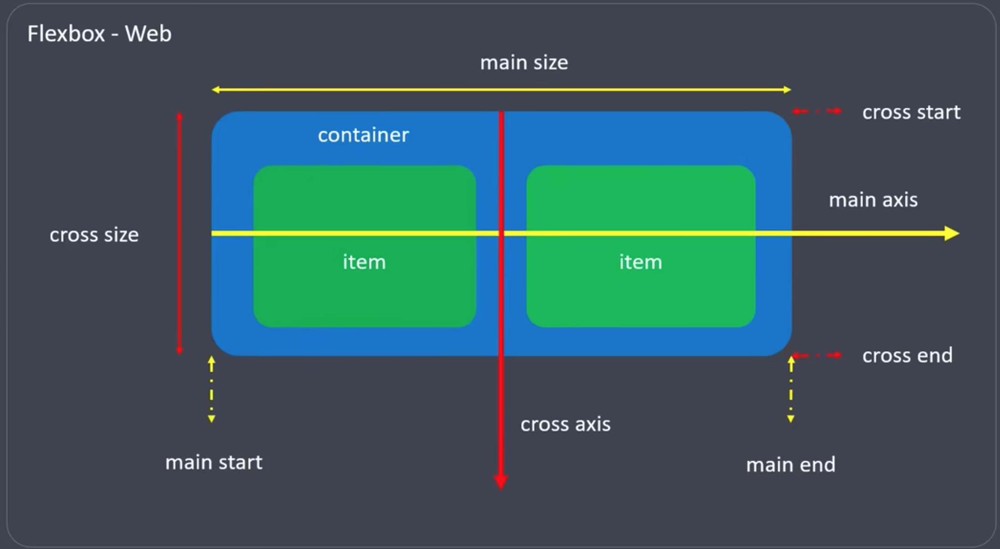
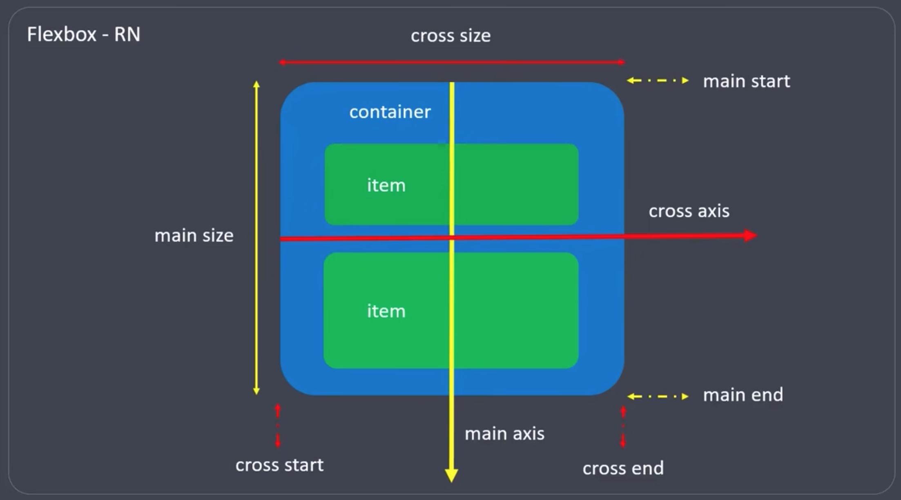
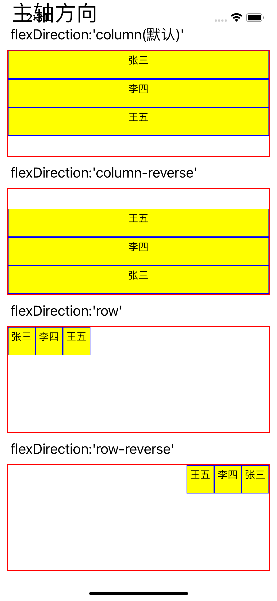
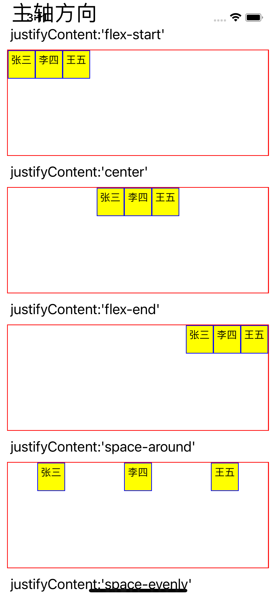
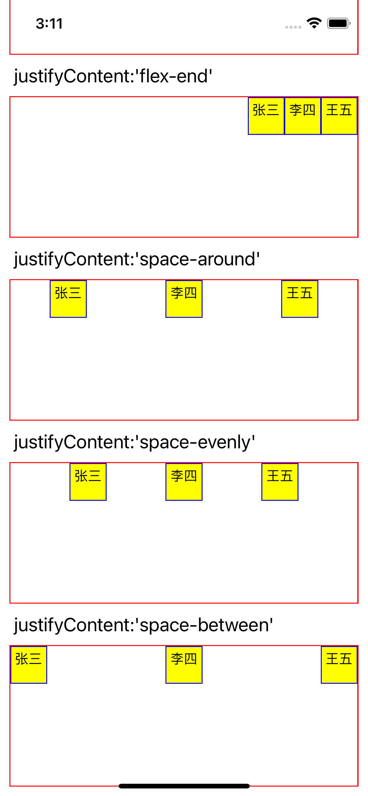

## 样式布局

## 2.StyleSheet
声明样式的api

- 特性：1.没有继承性；2.采用小驼峰；3.所有尺寸没有单位；
### 2.1 声明方法
通过style属性直接声明:
  - 属性值为对象：<组件 style={{样式}}/>
  - 属性值为数组：<组件 style={[{样式1}，...,{样式N}]}> (后面的样式信息会覆盖前面的)

在style属性中调用StyleSheet声明的样式：
    
 - 引入： `import {StyleSheet,View} from 'react-native'`
 - 声明： `const styles = StyleSheet.create({foo:{样式1},bar:{样式2}})`
 - 使用： `<View style={{style.foo,style.bar}}>内容</view>`   


### 3.FlexBox

#### 3.1 相关名词
- 容器(container)：采用Flex布局的元素，称为Flex容器(flex container)，简称”容器“
- 项目(item)： 容器所有子元素，称为Flex项目（flex item）简称”项目“
- 主轴（main axis）
- 交叉轴(cross axis)

关于FlexBox的主轴与交叉轴方向在web于React-native上的异同如图：




 
 #### 3.2 属性
 
- flexDirection 
  - 声明主轴方向：row（Web 默认）| column(RN默认) 
- justifyContent
  - 声明项目在主轴上的对齐方式
- alignItems
  - 声明项目在交叉轴上的对齐方式
- flex
  - 声明项目在主轴上的尺寸比例     

##### 3.2.1 flexDirection
代码演示：
```
import React, {Component} from 'react';
import {Text, StyleSheet, View, ScrollView} from 'react-native';

export default class flexdirection extends Component {
  render() {
    return (
      <ScrollView>
        <Text style={styles.h2}> 主轴方向 </Text>
        <View>
          <Text style={styles.h3}> flexDirection:'column(默认)' </Text>
          <View style={styles.container}>
            <Text style={styles.itemBase}>张三</Text>
            <Text style={styles.itemBase}>李四</Text>
            <Text style={styles.itemBase}>王五</Text>
          </View>

          <Text style={styles.h3}> flexDirection:'column-reverse' </Text>
          <View style={[styles.container, styles.flexColumnReverse]}>
            <Text style={styles.itemBase}>张三</Text>
            <Text style={styles.itemBase}>李四</Text>
            <Text style={styles.itemBase}>王五</Text>
          </View>

          <Text style={styles.h3}> flexDirection:'row' </Text>
          <View style={[styles.container, styles.flexRow]}>
            <Text style={styles.itemBase}>张三</Text>
            <Text style={styles.itemBase}>李四</Text>
            <Text style={styles.itemBase}>王五</Text>
          </View>

          <Text style={styles.h3}> flexDirection:'row-reverse' </Text>
          <View style={[styles.container, styles.flexRowReverse]}>
            <Text style={styles.itemBase}>张三</Text>
            <Text style={styles.itemBase}>李四</Text>
            <Text style={styles.itemBase}>王五</Text>
          </View>
        </View>
      </ScrollView>
    );
  }
}

const styles = StyleSheet.create({
  container: {
    height: 150,
    margin: 10,
    borderWidth: 1,
    borderColor: 'red',
  },
  h2: {
    fontSize: 30,
    marginHorizontal: 10,
  },
  h3: {
    fontSize: 20,
    marginHorizontal: 10,
  },
  itemBase: {
    height: 40,
    textAlign: 'center',
    backgroundColor: 'yellow',
    borderColor: 'blue',
    borderWidth: 1,
    padding: 4,
  },
  // 主轴方向为垂直方向
  flexColumn: {
    flexDirection: 'column',
  },
  flexColumnReverse: {
    flexDirection: 'column-reverse',
  },
  //主轴方向为水平方向
  flexRow: {
    flexDirection: 'row',
  },
  flexRowReverse: {
    flexDirection: 'row-reverse',
  },
});
```

运行效果如图：



##### 3.2.2 justifyContent
代码示例

```
import React, {Component} from 'react';
import {Text, StyleSheet, View, ScrollView} from 'react-native';

export default class flexdirection extends Component {
  render() {
    return (
      <ScrollView>
        <Text style={styles.h2}> 主轴方向 </Text>
        <View>
          <Text style={styles.h3}> justifyContent:'flex-start' </Text>
          <View
            style={[
              styles.container,
              styles.flexRow,
              styles.JustifyContentStart,
            ]}>
            <Text style={styles.itemBase}>张三</Text>
            <Text style={styles.itemBase}>李四</Text>
            <Text style={styles.itemBase}>王五</Text>
          </View>

          <Text style={styles.h3}> justifyContent:'center' </Text>
          <View
            style={[
              styles.container,
              styles.flexRow,
              styles.JustifyContentCenter,
            ]}>
            <Text style={styles.itemBase}>张三</Text>
            <Text style={styles.itemBase}>李四</Text>
            <Text style={styles.itemBase}>王五</Text>
          </View>

          <Text style={styles.h3}> justifyContent:'flex-end' </Text>
          <View
            style={[
              styles.container,
              styles.flexRow,
              styles.JustifyContentEnd,
            ]}>
            <Text style={styles.itemBase}>张三</Text>
            <Text style={styles.itemBase}>李四</Text>
            <Text style={styles.itemBase}>王五</Text>
          </View>

          <Text style={styles.h3}> justifyContent:'space-around' </Text>
          <View
            style={[
              styles.container,
              styles.flexRow,
              styles.JustifyContentSpaceAround,
            ]}>
            <Text style={styles.itemBase}>张三</Text>
            <Text style={styles.itemBase}>李四</Text>
            <Text style={styles.itemBase}>王五</Text>
          </View>

          <Text style={styles.h3}> justifyContent:'space-evenly' </Text>
          <View
            style={[
              styles.container,
              styles.flexRow,
              styles.JustifyContentEvenly,
            ]}>
            <Text style={styles.itemBase}>张三</Text>
            <Text style={styles.itemBase}>李四</Text>
            <Text style={styles.itemBase}>王五</Text>
          </View>

          <Text style={styles.h3}> justifyContent:'space-between' </Text>
          <View
            style={[
              styles.container,
              styles.flexRow,
              styles.JustifyContentSpaceBetween,
            ]}>
            <Text style={styles.itemBase}>张三</Text>
            <Text style={styles.itemBase}>李四</Text>
            <Text style={styles.itemBase}>王五</Text>
          </View>
        </View>
      </ScrollView>
    );
  }
}

const styles = StyleSheet.create({
  container: {
    height: 150,
    margin: 10,
    borderWidth: 1,
    borderColor: 'red',
  },
  h2: {
    fontSize: 30,
    marginHorizontal: 10,
  },
  h3: {
    fontSize: 20,
    marginHorizontal: 10,
  },
  itemBase: {
    height: 40,
    textAlign: 'center',
    backgroundColor: 'yellow',
    borderColor: 'blue',
    borderWidth: 1,
    padding: 4,
  },
  // 主轴方向为垂直方向
  flexColumn: {
    flexDirection: 'column',
  },
  flexColumnReverse: {
    flexDirection: 'column-reverse',
  },
  flexRow: {
    flexDirection: 'row',
  },
  flexRowReverse: {
    flexDirection: 'row-reverse',
  },

  JustifyContentStart: {
    justifyContent: 'flex-start',
  },
  JustifyContentEnd: {
    justifyContent: 'flex-end',
  },
  JustifyContentCenter: {
    justifyContent: 'center',
  },
  JustifyContentEvenly: {
    justifyContent: 'space-evenly',
  },
  JustifyContentSpaceBetween: {
    justifyContent: 'space-between',
  },
  JustifyContentSpaceAround: {
    justifyContent: 'space-around',
  },
});
```

效果如图：

