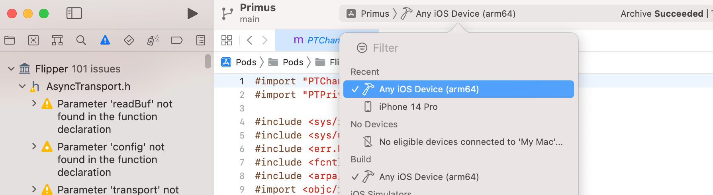
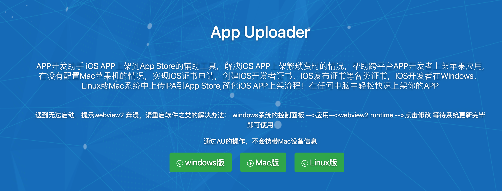

## 项目的打包发布

### 1.Andriod
Android 要求所有应用都有一个数字签名才会被允许安装在用户手机上，所以在把应用发布到应用市场之前，你需要先生成一个签名的 AAB 或 APK 包（Google Play 现在要求 AAB 格式，而国内的应用市场目前仅支持 APK 格式。)

#### 1.1 生成一个签名密钥

你可以用keytool命令生成一个私有密钥。在 Windows 上keytool命令放在 JDK 的 bin 目录中（比如C:\Program Files\Java\jdkx.x.x_x\bin），你可能需要在命令行中先进入那个目录才能执行此命令。
```
$ keytool -genkeypair -v -storetype PKCS12 -keystore my-release-key.keystore -alias my-key-alias -keyalg RSA -keysize 2048 -validity 10000
```

最后它会生成一个叫做`my-release-key.keystore`的密钥库文件

在运行上面这条语句之后，密钥库里应该已经生成了一个单独的密钥，有效期为 10000 天。--alias 参数后面的别名是你将来为应用签名时所需要用到的，所以记得记录这个别名

#### 1.2 设置 gradle 变量
1. 把my-release-key.keystore文件放到你工程中的android/app文件夹下。
2. 编辑~/.gradle/gradle.properties（全局配置，对所有项目有效）或是项目目录/android/gradle.properties（项目配置，只对所在项目有效）。如果没有gradle.properties文件你就自己创建一个，添加如下的代码（注意把其中的****替换为相应密码）
注意：~符号表示用户目录，比如 windows 上可能是C:\Users\用户名，而 mac 上可能是/Users/用户名

```
MYAPP_RELEASE_STORE_FILE=my-release-key.keystore
MYAPP_RELEASE_KEY_ALIAS=my-key-alias
MYAPP_RELEASE_STORE_PASSWORD=*****
MYAPP_RELEASE_KEY_PASSWORD=*****
```
上面的这些会作为 gradle 的变量，在后面的步骤中可以用来给应用签名。

>
>关于密钥库的注意事项:：如果你不想以明文方式保存密码，同时你使用的是 macOS 系统，那么你也可
>以把密码保存到钥匙串（Keychain）中。这样一来你就可以省略掉上面配置中的后两行（即 
>MYAPP_RELEASE_STORE_PASSWORD 和 MYAPP_RELEASE_KEY_PASSWORD）。
>

#### 1.3 把签名配置加入到项目的 gradle 配置中
编辑你项目目录下的android/app/build.gradle，添加如下的签名配置：
```
...
android {
    ...
    defaultConfig { ... }
    signingConfigs {
        release {
            if (project.hasProperty('MYAPP_RELEASE_STORE_FILE')) {
                storeFile file(MYAPP_RELEASE_STORE_FILE)
                storePassword MYAPP_RELEASE_STORE_PASSWORD
                keyAlias MYAPP_RELEASE_KEY_ALIAS
                keyPassword MYAPP_RELEASE_KEY_PASSWORD
            }
        }
    }
    buildTypes {
        release {
            ...
            signingConfig signingConfigs.release
        }
    }
}
...
```

#### 1.4 生成发行 APK 包
只需在终端中运行以下命令：

```
$ cd android
$ ./gradlew assembleRelease
```

>
>译注：cd android表示进入 android 目录（如果你已经在 android 目录中了那就不用输入
>了）。./gradlew assembleRelease在 macOS、Linux 或是 windows 的 PowerShell 环境中
>表示执行当前目录下的名为 gradlew 的脚本文件，且其运行参数为 assembleRelease，注意这个./
>不可省略；而在 windows 的传统 CMD 命令行下则需要去掉./。
>


生成的 APK 文件位于android/app/build/outputs/apk/release/app-release.apk，它已经可以用来发布了。

#### 1.5 测试应用的发行版本
在把发行版本提交到 Play Store 之前，你应该做一次最终测试。输入以下命令可以在设备上安装发行版本:
```
$ npx react-native run-android --variant=release
```

注意--variant=release参数只能在你完成了上面的签名配置之后才可以使用。你现在可以关掉运行中的 packager 了，因为你所有的代码和框架依赖已经都被打包到 apk 包中，可以离线运行了。


### 2.iOS

react-native version 0.71

#### 2.1 添加包含原生代码的库

- 自动链接

```
$ npm install 
```

#### 2.2 启动模拟器

在项目目录下运行`npx react-native run-ios`

#### 2.3 上架Appstore

- 配置release scheme
通过Product -> Scheme -> Edit Scheme.选择Run,选取Build Configuration为Release.

- 编辑发布App
使用 ⌘B 或 从菜单栏选择 Product → Build 编译发布 app。

- 生成Archive
Xcode菜单选择Product -> Archive，如果Archive是灰色的就选择要打包的ios设备如图：


### 上传至TestFlight

1. 下载上传工具，Mac下载[Appuploader](https://www.appuploader.net/)



1.1 下载并解压，双击应用程序打开工具
1.2 使用注册好的AppleID登录，选择未支付688
1.3 在Appuploader工具中添加Bundle ID，可随意设置名称，需与Xcode中Signing&Capabilities中的Bundle Identifier一致
1.4 进入描述文件管理，创建描述管理文件，获取uuid可通过在手机safari浏览器中输入网址[https://udid.sanfenmi.cn](https://udid.sanfenmi.cn)获取
1.5 进入证书管理，创建证书(development 开发证书；distribution 发布证书)，名称密码自行编写，密码须记住。对应HBuilder打包时的私钥密码（选择iOS Distribution(App Store and Ad Hoc)类型），选择证书导出p12文件。

2. 申请开发者账号，制作BundleID,P12证书，描述文件
3. 用制作好的证书打包ipa文件
4. 登录[AppStore Connect](https://appstoreconnect.apple.com/)创建应用
5. 使用工具上传应用

