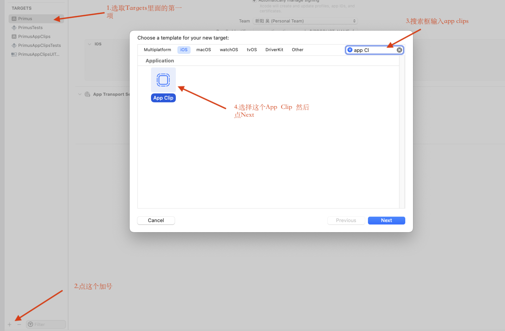
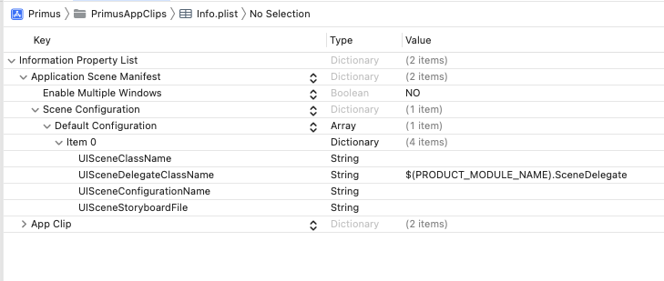
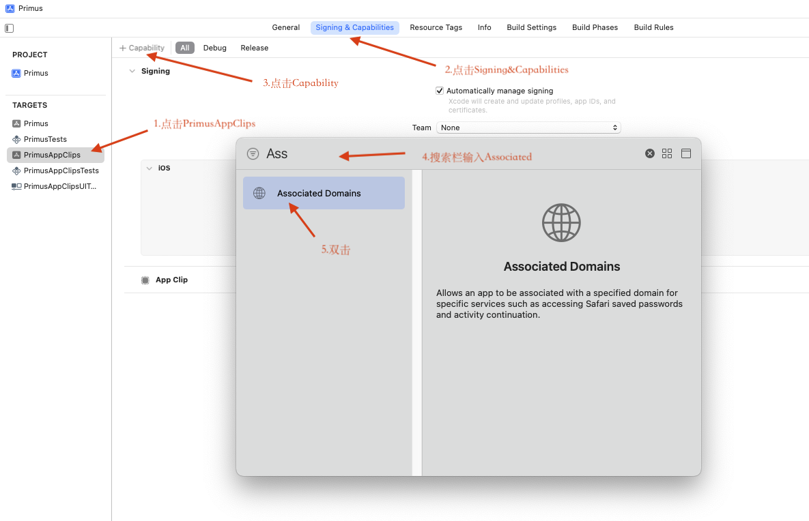
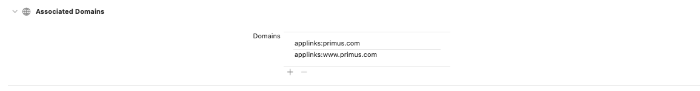

#  创建Appclips流程


## 1. 添加 App Clips 目标
### 1.1 打开项目：

- 使用 Xcode 打开你的 iOS 项目 (.xcworkspace 或 .xcodeproj 文件)。

### 1.2 添加 App Clip 目标：

- 点击项目名称 > Targets > + 按钮。
- 选择 App Clip 模板。


- 点击 Next，为 App Clip 目标命名，例如 YourAppClip。
- 完成后，Xcode 会自动为你生成一个新的 App Clip 目标，包含基本的 Info.plist 和入口文件。

### 1.3 配置 App Group（可选）：

- 如果主应用和 App Clip 需要共享数据（如 NSUserDefaults 或文件存储），需要设置 App Group：
  - 选择主应用和 App Clip 目标。
  - 进入 Signing & Capabilities，点击 + Capability，添加 App Groups。
  - 创建一个共享的 App Group（如 group.com.yourapp.shared）。
  
  ## 2. 配置 App Clip 入口点
### 2.1 设置 Info.plist
确保 App Clip 目标的 Info.plist 包含以下关键配置：
```
<key>UIApplicationSceneManifest</key>
<dict>
    <key>UISceneConfigurations</key>
    <dict>
        <key>Default Configuration</key>
        <array>
            <dict>
                <key>UISceneDelegateClassName</key>
                <string>$(PRODUCT_MODULE_NAME).SceneDelegate</string>
            </dict>
        </array>
    </dict>
</dict>

```
配置完如图所示：

### 2.2 配置 Associated Domains
- (1) 在 Xcode 中启用 Associated Domains
   - 打开 Xcode 项目，选择 App Clip Target。
   - 点击 Signing & Capabilities。
   - 点击左上角的 + Capability 按钮。
   - 在弹出的列表中选择 Associated Domains，添加到项目中。
   - 添加你的域名，格式如下：
   
   ```
   applinks:yourapp.com
   applinks:www.yourapp.com
   ```
具体情形如图：



- (2) 配置服务器的 AASA 文件
1. 创建 AASA 文件
   - 在服务器的根目录中，创建一个 JSON 文件，命名为 
  
   ```
   apple-app-site-association
   ```
   - 文件内容示例如下:
  
   ```json
   {
    "applinks": {
    "apps": [],
    "details": [
      {
        "appIDs": ["TEAM_ID.com.yourapp.clip"],
        "paths": ["*"]
      }
     ]
    }
   }
   ```
   
    -  TEAM_ID：开发者账户的 Team ID（可在 Apple 开发者账户中查看）。
    - com.yourapp.clip：App Clip的Bundle Identifier。
    - paths：URL 路径规则，例如：
        - "*"：匹配所有路径。
        - "/specificpath/*"：匹配特定路径。
        
        
2. 部署 AASA 文件
将 apple-app-site-association 文件放到服务器的以下路径：
```
https://yourapp.com/.well-known/apple-app-site-association
```

确保文件通过 HTTPS 提供，并且没有 .json 扩展名。

3. 设置正确的 MIME 类型 配置服务器，使文件返回以下 MIME 类型：
```
application/json
```

- (3) 验证配置

检查 AASA 文件是否可访问： 在浏览器中访问：
```
https://yourapp.com/.well-known/apple-app-site-association
```


## 3. 编写 App Clip 逻辑
### 3.1 实现 SceneDelegate
在 App Clip 的 SceneDelegate 文件中实现 App Clip 的逻辑：
```swift
import UIKit

class SceneDelegate: UIResponder, UIWindowSceneDelegate {
    var window: UIWindow?

    func scene(_ scene: UIScene, willConnectTo session: UISceneSession, options connectionOptions: UIScene.ConnectionOptions) {
        guard let windowScene = (scene as? UIWindowScene) else { return }

        let viewController = ViewController() // 替换为你的初始 ViewController
        let window = UIWindow(windowScene: windowScene)
        window.rootViewController = viewController
        self.window = window
        window.makeKeyAndVisible()
    }

    func scene(_ scene: UIScene, continue userActivity: NSUserActivity) {
        if let url = userActivity.webpageURL {
            // 处理从 URL 触发的逻辑
            print("App Clip Launched with URL: \(url)")
        }
    }
}

```

### 3.2 实现基本的 UI
根据需求，为 App Clip 实现精简的功能页面


## 4. 测试 App Clip

### 4.1 设置启动 URL
在 Xcode 的 Scheme Editor 中，为 App Clip 设置启动参数：

选择 App Clip 目标。
点击 Edit Scheme > Run > Arguments Passed On Launch。
添加模拟测试的 URL，例如：
```
https://yourapp.com/test
```
### 4.2 使用设备或模拟器调试
确保 App Clip 使用轻量的功能模块，加载时间小于 2 秒。
使用真实设备测试关联域名和 URL 触发。