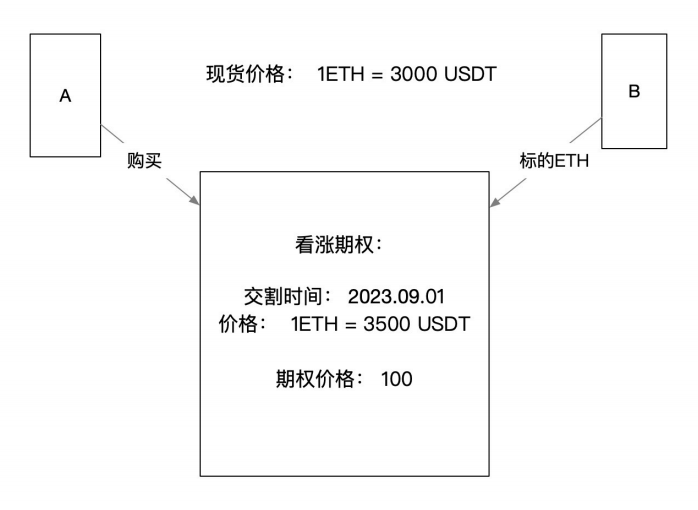

# Defi 衍生品

## 0x 协议

链下撮合，链上结算

吃单人将挂单人的签名提交到链上

[https://0x.org/docs/core-concepts#digital-signature](https://0x.org/docs/core-concepts#digital-signature)

## Uniswap 无常损失

- 流动性提供者⽆常损失：⼀对代币存⼊`Uniswap`后，如果⼀种代币以另⼀种进⾏计价的价格上升，在价格上升后取出，总价格⽐原价值低⼀些低的部分就是损失。

[参考文章链接](https://zhuanlan.zhihu.com/p/268435169)

## Uniswap 闪电兑

### 正常兑换

### 闪电兑换

### Uniswap 闪电兑换套利

假设有两个 DEX 有价差：
• 在 Pair1 中 1 TokenA = 2 TokenB
• 在 Pair2 中 1.5 TokenA = 2 TokenB
• 如何在这两个 DEX 中套利？
• 我们可以从 Pair1 中借出 2 TokenB， 在Pair2中兑换处 1.5 TokenA， 把 1 TokenA 还回 Pair1
• 净赚 0.5 TokenA

流程图如下：

#### 示例代码：

代码库：[https://github.com/xilibi2003/v2-periphery](https://github.com/xilibi2003/v2-periphery)
⽂件：contracts/FlashSwap.sol

### Uniswap 价格预言机

#### Uniswap TWAP 价格

- `TWAP` = Time-Weighted Average Price，即时间加权平均价格
- `price0CumulativeLast`、`price1CumulativeLast` 记录了`token`的累加价格
    - `priceCumulativeLast1` = `priceCumulativeLast1` + `price2` * `timeElapsed`;

 

示意图：

在合约⾥间隔调⽤`update()`记录累计价格并计算平均价格

代码库：[https://github.com/xilibi2003/v2-periphery](https://github.com/xilibi2003/v2-periphery)

⽂件：[contracts/examples/ExampleOracleSimple.sol](https://github.com/Uniswap/v2-periphery/blob/master/contracts/examples/ExampleOracleSimple.sol)

## SushiSwap

- Uniswap: 
    - 提供流动性时才赚取资⾦池的交易费，撤回流动性不再获得相应的收⼊
    
-  SushiSwap = Uniswap + 流动性挖矿
    - 流动性挖矿：
         - 1. 为流动性提供者奖励
         - 2. 锁定流动性、弥补流动性损失
    - 公平发⾏协议币（`sushi`）：去中⼼化治理、`sushi`代币可持续给参与者带来协议收益

### 流动性挖矿

- **正向**：有效的激励⼯具，尤其是更⾼激励的池2 ，促使⼈们购买 sushi，推⾼sushi 价格，同时提⾼了挖矿池的收益。促进更多⼈购买 sushi
- **反向**：随着挖出的SUSHI越来越多，矿⼯卖SUSHI，某个时间点，卖出的SUSHI⽐买⼊的SUSHI多，SUSHI价格开始下降，收益下跌、抛售、进⼀步下跌，“矿塌了”

### SushiSwap 挖矿算法
- 参与质押的地址，如何分配奖励
    - 常规思路： ⽤数组记录每个⽤户的质押，for 循环给每⼀个地址计算奖励
    - 问题：Gas消耗

    

#### SushiSwap解决办法
- 奖励 = 每份额lp奖励（累计） * 份额（数量）
- 每份额lp奖励（累计） += ⼀段时间的累计sushi奖励 / 当前的中的质押lp数量
- 若⽤户从中间某点进⼊，之前的每份额的奖励不能作为⽤户的奖励，应扣除

### 代码分析

代码链接：[https://github.com/sushiswap/sushiswap](https://github.com/sushiswap/sushiswap)

##  Curve
Curve 协议采用了固定和与固定乘积相结合的方式来解决稳定币的流动性

参考⽂章：[https://medium.com/@cic.ethan/淺談穩定幣互換機制-從-balancer-到-curve-f638f29b33f9](https://medium.com/@cic.ethan/淺談穩定幣互換機制-從-balancer-到-curve-f638f29b33f9)

### 简单练习
- 以太坊测试⽹上部署两个⾃⼰的 ERC20 合约MyToken，部署两个Uniswap，创建两个Uniswap V2 流动池（PoolA 和 PoolB），形成价差。
    - 编写合约执⾏闪电贷（参考 V2 的ExampleFlashSwap）：
    - uniswapV2Call中，⽤从PoolA 收到的 TokenA 在PoolB 兑换为 TokenB 并还回到 uniswapV2 Pair 中

练习：[https://decer t.me/quests/2a63cf95-43ec-42ee-975f-2b41510492cd](https://decer t.me/quests/2a63cf95-43ec-42ee-975f-2b41510492cd)

## 衍⽣品相关协议

- ⾦融衍⽣品相关概念
    - 期货（合约）交易
    - 期权交易
        - 看涨期权、看跌期权
    - 杠杆交易
        - 杠杆做多、杠杆做空
- Perpetual vAmm 杠杆交易

### 期货

- **期货（合约）交易**(Future contract 、forward)：签订⼀个协议，在未来指定时间双⽅按约定价格买卖某种资（任何标的），通常使⽤订单簿的⽅式。交易的是物品，大宗商品使用比较多，可以提前锁定价格

链上⼀般是⽆交割⽇期的永续合约，以DYDX为代表

#### DYDX

- 订单簿模式：市价单、限价单，做市商提供流动性，根据订单成交，不需要预⾔机
- dYdX 保证⾦交易由三个合约实现，分别是：
- 代理合约（Proxy）：⽤于转移⽤户资⾦。
- 保证⾦合约（Margin contract）：提供使⽤保证⾦交易的功能。
- 保险⾦库合约（Vault）：将资⾦ / 代币锁定在仓位中。 •

 [https://github.com/dydxprotocol/protocol_v1](https://github.com/dydxprotocol/protocol_v1)

### 期权
- 期权(Option)：交易的是权利（起到保险的作⽤），在某个时间，有权以某个价格买⼊、卖出。通常作为对冲⼯具
    - 看涨期权（CALL）：有买⼊的权利，期权的购买者拥有在期权合约有效期内执行价格买进一定数量标的物的权利。
    
    - 看跌期权（PUT）：有卖出的权利，
    

如：Opyn、lyra 等协议

### 债券(Bond)

- 债券(Bond) ：⼀笔债务证明，只有债券，拥有讨债的权利（权利⽆期限）

### 简单练习

- 设计⼀个看涨期权 Token（ERC20）：
    - 创建期权Token 时，确认标的的价格与⾏权⽇期；
    - 发⾏⽅法（项⽬⽅⻆⾊）：根据转⼊的标的（ETH）发⾏期权 Token；
    - （可选）：可以⽤期权Token 与 USDT 以⼀个较低的价格创建交易对，模拟⽤户购买期权。
    - ⾏权⽅法（⽤户⻆⾊）：在到期⽇当天，可通过指定的价格兑换出标的资产，并销毁期权Token
    - 过期销毁（项⽬⽅⻆⾊）：销毁所有期权Token 赎回标的

相关练习：[https://decert.me/quests/5725236b-4e24-4c28-be69-2509087157c4](https://decert.me/quests/5725236b-4e24-4c28-be69-2509087157c4)

