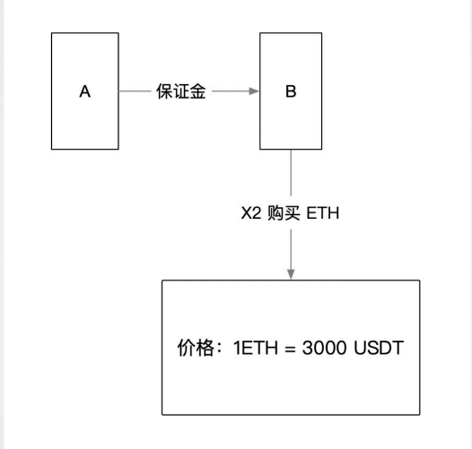
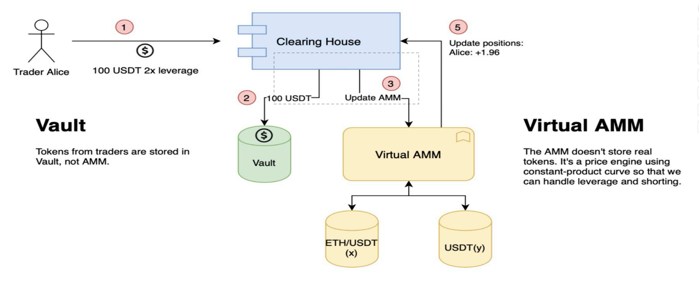
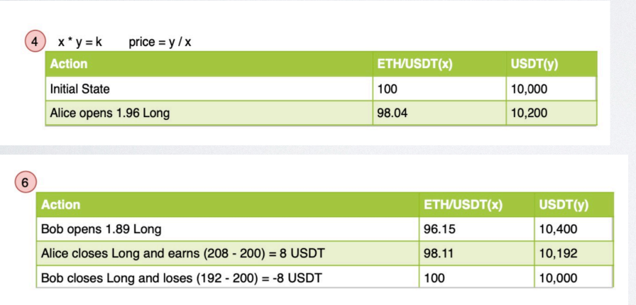

## 杠杆交易 
以数倍于⾃有资⾦的买⼊、卖出某资产

风险考虑，防⽌ A 亏损不还钱，由 A 缴纳保证⾦，由 B 代为持有仓位（也叫保证⾦交易），当 A 保证⾦ + 仓位价值 （快）不够 B 借出的资⾦时，B 将强制卖出仓位（清算-Liquidate）。

示意图：

### Perpetual Protocol
- vAmm： 虚拟流动性提供极⾼流动性，免于做市商的依赖 
- 没有真实的资⾦池：借的是虚拟币，获取的虚拟头⼨
- 多空双⽅互为对⼿
- 通过 Chainlink 喂价，结算资⾦费来保持价格不偏离

对于Perpetual来说，开多或者做空的人提供初始资金，然后Perpetual并不需要垫付对应倍数的资金到资金池中。而是采用虚拟的货币，即仅仅只是数值进入资金池，用户拿到的也不是真正的仓位，而是仓位的份额。

项目地址：[https://github.com/perpetual-protocol/perpetual-protocol](https://github.com/perpetual-protocol/perpetual-protocol)

交互示意图：

### 相关术语
- 杠杆倍数（leverge）
- 保证⾦（Margin） 
- 持仓仓位、头⼨（Postion）
- 仓位（名义）价值：头⼨ * 价格， 正数表⽰多头，负数表⽰空头。 
- PNL：盈亏（profit and loss），做多时：仓位价值-开仓价值，做空时：开仓价值 - 仓位价值 
- 保证⾦率（Margin Ratio） = （保证⾦ + PNL）/ 仓位价值  ,  当低于6.25％触发清算
- 资⾦费 = 头⼨ * 资⾦费率， 资⾦费率 = （TWAP - Oracle价格)/24， 资⾦费率为正时，多⽅向空⽅⽀付资⾦费。（​时间加权平均价格​（Time-Weighted Average Price）的缩写）
- 保障基⾦（InsuranceFund）：（清算获利），弥补⾏情剧烈波动带来的穿仓的损失。

[https://docs.perp.fi/v/perpetual-protocol-jian-jie/getting-started/how-it-works/zi-jin-fei-lv](https://docs.perp.fi/v/perpetual-protocol-jian-jie/getting-started/how-it-works/zi-jin-fei-lv)

### 期权
期权(Option):交易的是权利(起到保险的作用)，在某个时间，有权以某个价格买入，卖出。通常作为对冲工具。

- 看涨期权(CALL)：有买入的权利(期权的购买者拥有在期权合约有效期内按执行价格买进一定数量标的物的权利)
- 看跌期权(PUT)：有卖出的权利(又称卖权选择权，卖方期权，卖权，延卖权或敲出，看跌期权是指期权的购买者拥有在期权合约有效期内按执行价格卖出一定数量标的物的权利，但不负担必须卖出去的义务)

如：Opyn,lyra等协议
[https://app.lyra.finance/](https://app.lyra.finance/)
[https://github.com/lyra-finance/lyra-protocol](https://github.com/lyra-finance/lyra-protocol)
[https://github.com/opynfinance/GammaProtocol](https://github.com/opynfinance/GammaProtocol)

### 永续合约
类似于指定期货，没有到期日，引入资金费率(调节多空双方)，高杠，正向合约，反向合约(币本位)，保障金（Insuerance Fund），套利保值(hedging):对冲

### 债券
债券(Bond)：一笔债务证明，只有债券，拥有讨债的权利(权利无期限) 