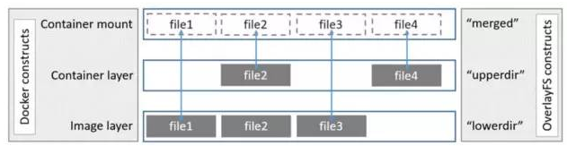
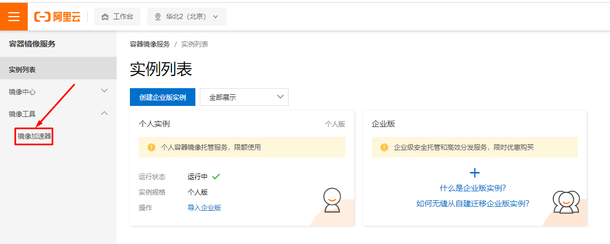

# Docker容器镜像

## 1 Docker容器镜像操作

### 1.1 查看本地容器镜像
#### 1.1.1 使用docker images命令查看

~~~powershell
# docker images
REPOSITORY   TAG       IMAGE ID       CREATED        SIZE
bash         latest    5557e073f11c   2 weeks ago    13MB
nginx        latest    605c77e624dd   3 weeks ago    141MB
centos       latest    5d0da3dc9764   4 months ago   231MB
~~~

#### 1.1.2 使用docker image命令查看

~~~powershell
# docker image list
REPOSITORY   TAG       IMAGE ID       CREATED        SIZE
bash         latest    5557e073f11c   2 weeks ago    13MB
nginx        latest    605c77e624dd   3 weeks ago    141MB
centos       latest    5d0da3dc9764   4 months ago   231MB
~~~

#### 1.1.3  查看docker容器镜像本地存储位置

> 考虑到docker容器镜像会占用本地存储空间，建议搭建其它存储系统挂载到本地以便解决占用大量本地存储的问题。

~~~powershell
# ls /var/lib/docker
buildkit  containers  image  network  overlay2  plugins  runtimes  swarm  tmp  trust  volumes
~~~

### 1.2 搜索Docker Hub容器镜像

#### 1.2.1  命令行搜索

~~~powershell
# docker search centos
~~~

~~~powershell
输出
NAME                              DESCRIPTION                                     STARS     OFFICIAL   AUTOMATED
centos                            The official build of CentOS.                   6987      [OK]
ansible/centos7-ansible           Ansible on Centos7                              135                  [OK]
consol/centos-xfce-vnc            Centos container with "headless" VNC session…   135                  [OK]
jdeathe/centos-ssh                OpenSSH / Supervisor / EPEL/IUS/SCL Repos - …   121                  [OK]
~~~

#### 1.2.2  Docker Hub Web界面搜索

[https://hub.docker.com/](https://hub.docker.com/)

### 1.3 Docker 容器镜像下载

~~~powershell
# docker pull centos
~~~

### 1.4 Docker容器镜像删除方法

~~~powershell
# docker images
REPOSITORY   TAG       IMAGE ID       CREATED        SIZE
bash         latest    5557e073f11c   2 weeks ago    13MB
nginx        latest    605c77e624dd   3 weeks ago    141MB
centos       latest    5d0da3dc9764   4 months ago   231MB
~~~

~~~powershell
# docker rmi centos
Untagged: centos:latest
Untagged: centos@sha256:a27fd8080b517143cbbbab9dfb7c8571c40d67d534bbdee55bd6c473f432b177
Deleted: sha256:5d0da3dc976460b72c77d94c8a1ad043720b0416bfc16c52c45d4847e53fadb6
Deleted: sha256:74ddd0ec08fa43d09f32636ba91a0a3053b02cb4627c35051aff89f853606b59
~~~

或

~~~powershell
# docker images
REPOSITORY   TAG       IMAGE ID       CREATED        SIZE
centos       latest    5d0da3dc9764   4 months ago   231MB
~~~

~~~powershell
# docker rmi 5d0da3dc9764
~~~

## 2 Docker容器镜像介绍

### 2.1 Docker Image

- Docker 镜像是只读的容器模板，是Docker容器基础
- 为Docker容器提供了静态文件系统运行环境（rootfs）
- 是容器的静止状态
- 容器是镜像的运行状态

### 2.2 联合文件系统

#### 2.2.1 联合文件系统定义

- 联合文件系统(union filesystem)
- 联合文件系统是实现联合挂载技术的文件系统
- 联合挂载技术可以实现在一个挂载点同时挂载多个文件系统，将挂载点的原目录与被挂载内容进行整合，使得最终可见的文件系统包含整合之后的各层文件和目录

#### 2.2.2 图解

### 2.3 Docker Overlay2

容器文件系统有多种存储驱动实现方式：aufs，devicemapper，overlay，overlay2 等，本次以overlay2为例进行说明。

#### 2.3.1 概念

- registry/repository： registry 是 repository 的集合，repository 是镜像的集合。
- image：image 是存储镜像相关的元数据，包括镜像的架构，镜像默认配置信息，镜像的容器配置信息等等。它是“逻辑”上的概念，并无物理上的镜像文件与之对应。
- layer：layer(镜像层) 组成了镜像，单个 layer 可以被多个镜像共享。

#### 2.3.2 查看Docker Host存储驱动方式

~~~powershell
# docker info | grep overlay
 Storage Driver: overlay2
~~~

#### 2.3.3 了解images分层

~~~powershell
# docker pull nginx
Using default tag: latest
latest: Pulling from library/nginx
a2abf6c4d29d: Pull complete
a9edb18cadd1: Pull complete
589b7251471a: Pull complete
186b1aaa4aa6: Pull complete
b4df32aa5a72: Pull complete
a0bcbecc962e: Pull complete
Digest: sha256:0d17b565c37bcbd895e9d92315a05c1c3c9a29f762b011a10c54a66cd53c9b31
Status: Downloaded newer image for nginx:latest
docker.io/library/nginx:latest
~~~

可以看到上述下载的镜像分为6层，如何找到这6层存储在Docker Host哪个位置呢？

首先查看nginx镜像

~~~powershell
# docker images
REPOSITORY   TAG       IMAGE ID       CREATED        SIZE
nginx        latest    605c77e624dd   3 weeks ago    141MB
~~~

通过其Image ID 605c77e624dd 就可以找到存储位置

~~~powershell
# ls /var/lib/docker/image/overlay2/
distribution  imagedb  layerdb  repositories.json
~~~

这个目录是查找的入口，非常重要。它存储了镜像管理的元数据。

- repositories.json 记录了 repo 与镜像 ID 的映射关系
- imagedb 记录了镜像架构，操作系统，构建镜像的容器 ID 和配置以及 rootfs 等信息
- layerdb 记录了每层镜像层的元数据。

通过短 ID 查找 repositories.json 文件，找到镜像 nginx 的长 ID，通过长 ID 在 imagedb 中找到该镜像的元数据：

~~~powershell
# cat /var/lib/docker/image/overlay2/repositories.json | grep 605c77e624dd
{"Repositories":"nginx":{"nginx:latest":"sha256:605c77e624ddb75e6110f997c58876baa13f8754486b461117934b24a9dc3a85","nginx@sha256:0d17b565c37bcbd895e9d92315a05c1c3c9a29f762b011a10c54a66cd53c9b31":"sha256:605c77e624ddb75e6110f997c58876baa13f8754486b461117934b24a9dc3a85"}}}}
~~~

~~~powershell
# cat /var/lib/docker/image/overlay2/imagedb/content/sha256/605c77e624ddb75e6110f997c58876baa13f8754486b461117934b24a9dc3a85
......
"os":"linux","rootfs":{"type":"layers","diff_ids":["sha256:2edcec3590a4ec7f40cf0743c15d78fb39d8326bc029073b41ef9727da6c851f","sha256:e379e8aedd4d72bb4c529a4ca07a4e4d230b5a1d3f7a61bc80179e8f02421ad8","sha256:b8d6e692a25e11b0d32c5c3dd544b71b1085ddc1fddad08e68cbd7fda7f70221","sha256:f1db227348d0a5e0b99b15a096d930d1a69db7474a1847acbc31f05e4ef8df8c","sha256:32ce5f6a5106cc637d09a98289782edf47c32cb082dc475dd47cbf19a4f866da","sha256:d874fd2bc83bb3322b566df739681fbd2248c58d3369cb25908d68e7ed6040a6"]}}
~~~

这里仅保留我们想要的元数据 rootfs。在 rootfs 中看到 layers 有6层，这6层即对应镜像的6层镜像层。并且，自上而下分别映射到容器的底层到顶层。

## 3 Docker容器镜像操作命令

### 3.1  docker commit

上节提到容器内写文件会反映在 overlay 的可读写层，那么读写层的文件内容可以做成镜像吗？

可以。docker 通过 commit 和 build 操作实现镜像的构建。commit 将容器提交为一个镜像，build 在一个镜像的基础上构建镜像。

使用 commit 将上节的容器提交为一个镜像：

~~~powershell
[root@355e99982248 /]#   ctrl+p+q
~~~

~~~powershell
# docker ps
CONTAINER ID   IMAGE           COMMAND                  CREATED          STATUS          PORTS     NAMES
355e99982248   centos:latest   "bash"                   21 minutes ago   Up 21 minutes             fervent_perlman
~~~

~~~powershell
# docker commit 355e99982248
sha256:8965dcf23201ed42d4904e2f10854d301ad93b34bea73f384440692e006943de
~~~

~~~powershell
# docker images
REPOSITORY   TAG       IMAGE ID       CREATED              SIZE
<none>       <none>    8965dcf23201   About a minute ago   231MB
~~~

image短ID`8965dcf23201` 即为容器提交的镜像，查看镜像的 `imagedb`元数据：

~~~powershell
# cat  /var/lib/docker/image/overlay2/imagedb/content/sha256/8965dcf23201ed42d4904e2f10854d301ad93b34bea73f384440692e006943de
......
"os":"linux","rootfs":{"type":"layers","diff_ids":["sha256:74ddd0ec08fa43d09f32636ba91a0a3053b02cb4627c35051aff89f853606b59","sha256:551c3089b186b4027e949910981ff1ba54114610f2aab9359d28694c18b0203b"]}}
~~~

可以看到镜像层自上而下的前1个镜像层 diff_id 和 centos 镜像层 diff_id 是一样的，说明每层镜像层可以被多个镜像共享。而多出来的一层镜像层内容即是上节我们写入文件的内容：

~~~powershell
# echo -n "sha256:74ddd0ec08fa43d09f32636ba91a0a3053b02cb4627c35051aff89f853606b59 sha256:551c3089b186b4027e949910981ff1ba54114610f2aab9359d28694c18b0203b" | sha256sum -
92f7208b1cc0b5cc8fe214a4b0178aa4962b58af8ec535ee7211f335b1e0ed3b  -
~~~

~~~powershell
# cd /var/lib/docker/image/overlay2/layerdb/sha256/92f7208b1cc0b5cc8fe214a4b0178aa4962b58af8ec535ee7211f335b1e0ed3b
[root@192 92f7208b1cc0b5cc8fe214a4b0178aa4962b58af8ec535ee7211f335b1e0ed3b]# ls
cache-id  diff  parent  size  tar-split.json.gz

[root@192 92f7208b1cc0b5cc8fe214a4b0178aa4962b58af8ec535ee7211f335b1e0ed3b]# cat cache-id
250dc0b4f2c5f27952241a55cd4c286bfaaf8af4b77c9d0a38976df4c147cb95

[root@192 92f7208b1cc0b5cc8fe214a4b0178aa4962b58af8ec535ee7211f335b1e0ed3b]# ls /var/lib/docker/overlay2/250dc0b4f2c5f27952241a55cd4c286bfaaf8af4b77c9d0a38976df4c147cb95
diff  link  lower  work

[root@192 92f7208b1cc0b5cc8fe214a4b0178aa4962b58af8ec535ee7211f335b1e0ed3b]# ls /var/lib/docker/overlay2/250dc0b4f2c5f27952241a55cd4c286bfaaf8af4b77c9d0a38976df4c147cb95/diff
msb.txt

~~~

### 3.2 docker save

> 导出容器镜像，方便分享。

~~~powershell
# docker save -o centos.tar centos:latest  
~~~

~~~powershell
# ls

centos.tar  
~~~

### 3.3 docker load

> 把他人分享的容器镜像导入到本地，这通常是容器镜像分发方式之一。

~~~powershell
# docker load -i centos.tar
~~~

### 3.4 docker export

> 把正在运行的容器导出

~~~powershell
# docker ps
CONTAINER ID   IMAGE           COMMAND                  CREATED       STATUS       PORTS     NAMES
355e99982248   centos:latest   "bash"                   7 hours ago   Up 7 hours             fervent_perlman
~~~

~~~powershell
# docker export -o centos7.tar 355e99982248
~~~

~~~powershell
# ls
centos7.tar
~~~

### 3.5 docker import

> 导入使用docker export导入的容器做为本地容器镜像。

~~~powershell
# ls
centos7.tar 
~~~

~~~powershell
# docker import centos7.tar centos7:v1
~~~

~~~powershell
# docker images
REPOSITORY   TAG       IMAGE ID       CREATED              SIZE
centos7      v1        3639f9a13231   17 seconds ago       231MB
~~~

通过`docker save`与`docker load`及`docker export`与`docker import`分享容器镜像都是非常麻烦的

# 4、Docker 容器镜像加速器及本地容器镜像仓库

## 4.1 容器镜像加速器

> 由于国内访问国外的容器镜像仓库速度比较慢，因此国内企业创建了容器镜像加速器，以方便国内用户使用容器镜像。

### 4.1.1 获取阿里云容器镜像加速地址

### 4.1.2 配置docker daemon使用加速器

~~~powershell
添加daemon.json配置文件
# vim /etc/docker/daemon.json
# cat /etc/docker/daemon.json
{
        "registry-mirrors": ["https://s27w6kze.mirror.aliyuncs.com"]
}
~~~

~~~powershell
重启docker
# systemctl daemon-reload
# systemctl restart docker
~~~
 
~~~powershell
尝试下载容器镜像
# docker pull centos
~~~

## 4.2 容器镜像仓库

### 4.2.1 dockerhub

#### 4.2.1.1 注册

> 准备邮箱及用户ID

