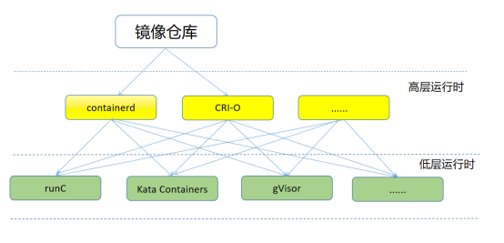
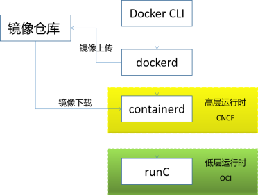
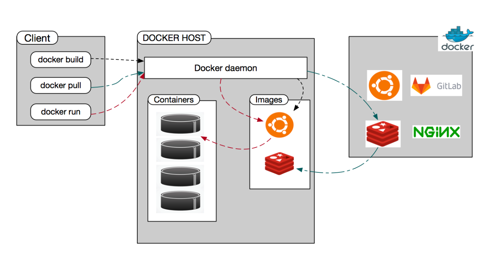
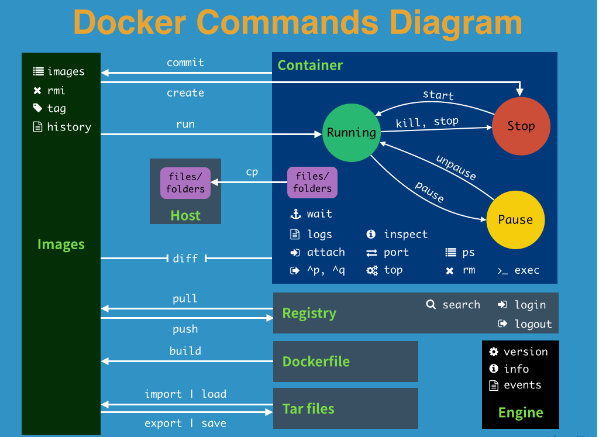
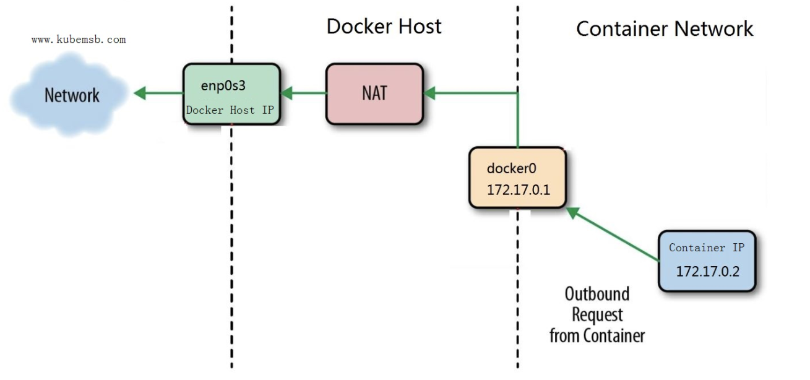

#  Docke

## 1、容器运行时（Container Runtime） 是什么

容器的运行时（runtime）就是运行和管理容器进程、镜像的工具。

## 2、 容器运行时分类

`Docker`属于容器技术早期的发展项目，也是目前最广泛的容器引擎技术。当然，随着容器生态圈的日益繁荣，业界慢慢也出现了其他各种运行时工具，如containerd、rkt、Kata Container、CRI-O等。这些工具提供的功能不尽相同，有些只有容器运行的功能，有些除运行容器外还提供了容器镜像的管理功能。根据容器运行时提供功能，可以将容器运行时分为**低层运行时**和**高层运行时**。

### 2.1 低层运行时

低层运行时主要负责与宿主机操作系统打交道，根据指定的容器镜像在宿主机上运行容器的进程，并对容器的整个生命周期进行管理。而这个低层运行时，正是负责执行我们前面讲解过的设置容器 Namespace、Cgroups等基础操作的组件。常见的低层运行时种类有：

-  runc：传统的运行时，基于Linux Namespace和Cgroups技术实现，代表实现Docker
-  runv：基于虚拟机管理程序的运行时，通过虚拟化 guest kernel，将容器和主机隔离开来，使得其边界更加清晰，代表实现是Kata Container和Firecracker
- runsc：runc + safety ，通过拦截应用程序的所有系统调用，提供安全隔离的轻量级容器运行时沙箱，代表实现是谷歌的gVisor


### 2.2 高层运行时

高层运行时主要负责镜像的管理、转化等工作，为容器的运行做前提准备。主流的高层运行时主要containerd和CRI-O。

高层运行时与低层运行时各司其职，容器运行时一般先由高层运行时将容器镜像下载下来，并解压转换为容器运行需要的操作系统文件，再由低层运行时启动和管理容器。

### 2.3 低层运行时与高层运行时之间的关系



容器运行时(Container Runtime)更侧重于运行容器，为容器设置命名空间和控制组（cgroup），也被称为底层容器运行时。高层的容器运行时或容器引擎专注于格式、解包、管理和镜像共享。它们还为开发者提供 API。

## 3、Docker组成

我们发现在安装`docker`时，不仅会安装`docker engine`与`docker cli`工具，而且还会安装`containerd`，这是为什么呢？

`Docker`最初是一个单体引擎，主要负责容器镜像的制作、上传、拉取及容器的运行及管理。随着容器技术的繁荣发展，为了促进容器技术相关的规范生成和`Docker`自身项目的发展，`Docker`将单体引擎拆分为三部分，分别为`runC`、`containerd`和`dockerd`

其中：

- runC主要负责容器的运行和生命周期的管理（即前述的低层运行时）
- containerd主要负责容器镜像的下载和解压等镜像管理功能（即前述的高层运行时）
- dockerd主要负责提供镜像制作、上传等功能同时提供容器存储和网络的映射功能，同时也是Docker服务器端的守护进程，用来响应Docker客户端（命令行CLI工具）发来的各种容器、镜像管理的任务。

`Docker`公司将`runC`捐献给了`OCI`，将`containerd`捐献给了`CNCF`，剩下的`dockerd`作为`Docker`运行时由`Docker`公司自己维护。




> *开放容器计划(Open Container Initiative)*（OCI）是一个 Linux 基金会的项目。其目的是设计某些开放标准或围绕如何与容器运行时和容器镜像格式工作的结构。它是由 Docker、rkt、CoreOS 和其他行业领导者于 2015 年 6 月建立的。
>
> 两个规范：
>
> 1、**镜像规范**
>
> 该规范的目标是创建可互操作的工具，用于构建、传输和准备运行的容器镜像。
>
> 该规范的高层组件包括：
>
> - 镜像清单— 一个描述构成容器镜像的元素的文件
> - 镜像索引— 镜像清单的注释索引
> - 镜像布局— 一个镜像内容的文件系统布局
> - 文件系统布局 — 一个描述容器文件系统的变更集
> - 镜像配置 — 确定镜像层顺序和配置的文件，以便转换成 运行时捆包
> - 转换— 解释应该如何进行转换的文件
> - 描述符 — 一个描述被引用内容的类型、元数据和内容地址的参考资料
>
> **2、运行时规范**
>
> 该规范用于定义容器的配置、执行环境和生命周期。`config.json` 文件为所有支持的平台提供了容器配置，并详细定义了用于创建容器的字段。在详细定义执行环境时也描述了为容器的生命周期定义的通用操作，以确保在容器内运行的应用在不同的运行时环境之间有一个一致的环境。
>
> Linux 容器规范使用了各种内核特性，包括 *命名空间(namespace)*、 *控制组(cgroup)*、 *权能(capability)*、LSM 和文件系统 *隔离(jail)*等来实现该规范。


>云原生计算基金会（CNCF）成立于 2015 年，旨在传播和推广云原生基金会的开放标准和项目。CNCF 在市场上享有全球认可，并在定义和引领云计算的未来方面发挥着至关重要的作用。

## 4、容器运行机制

当我们使用`docker run`运行一个命令在容器中时，在容器运行时层面会发生什么？

- 1、如果本地没有镜像，则从镜像 登记仓库(registry)拉取镜像

- 2、镜像被提取到一个写时复制（COW）的文件系统上，所有的容器层相互堆叠以形成一个合并的文件系统

- 3、为容器准备一个挂载点

- 4、从容器镜像中设置元数据，包括诸如覆盖 CMD、来自用户输入的 ENTRYPOINT、设置 SECCOMP 规则等设置，以确保容器按预期运行

- 5、提醒内核为该容器分配某种隔离，如进程、网络和文件系统（ 命名空间(namespace)）

- 6、提醒内核为该容器分配一些资源限制，如 CPU 或内存限制（ 控制组(cgroup)）

- 7、传递一个 系统调用(syscall)给内核用于启动容器

- 8、设置 SELinux/AppArmor

以上，就是容器运行时负责的所有的工作。当我们提及容器运行时，想到的可能是 runc、lxc、containerd、rkt、cri-o 等等。这些都是容器引擎和容器运行时，每一种都是为不同的情况建立的。


## 5、Docker安装

### 5.1 Docker安装

#### 检查卸载老版本docker

~~~powershell
$ apt-get remove docker docker-engine docker.io containerd runc
~~~

#### ubuntu安装
~~~
# step 1: 安装必要的一些系统工具
sudo apt-get update
sudo apt-get -y install apt-transport-https ca-certificates curl software-properties-common
# step 2: 安装GPG证书
curl -fsSL https://mirrors.aliyun.com/docker-ce/linux/ubuntu/gpg | sudo apt-key add -
# Step 3: 写入软件源信息
sudo add-apt-repository "deb [arch=amd64] https://mirrors.aliyun.com/docker-ce/linux/ubuntu $(lsb_release -cs) stable"
# Step 4: 更新并安装Docker-CE
sudo apt-get -y update
sudo apt-get -y install docker-ce

# 安装指定版本的Docker-CE:
# Step 1: 查找Docker-CE的版本:
# apt-cache madison docker-ce
#   docker-ce | 17.03.1~ce-0~ubuntu-xenial | https://mirrors.aliyun.com/docker-ce/linux/ubuntu xenial/stable amd64 Packages
#   docker-ce | 17.03.0~ce-0~ubuntu-xenial | https://mirrors.aliyun.com/docker-ce/linux/ubuntu xenial/stable amd64 Packages
# Step 2: 安装指定版本的Docker-CE: (VERSION例如上面的17.03.1~ce-0~ubuntu-xenial)
# sudo apt-get -y install docker-ce=[VERSION]
~~~

#### 另外的安装办法
- 安装docker依赖

~~~
apt-get install ca-certificates curl gnupg lsb-release
~~~

- 添加Docker官方GPG密钥

~~~
curl -fsSL http://mirrors.aliyun.com/docker-ce/linux/ubuntu/gpg | sudo apt-key add -
~~~

- 添加Docker软件源

~~~
sudo add-apt-repository "deb [arch=amd64] http://mirrors.aliyun.com/docker-ce/linux/ubuntu $(lsb_release -cs) stable"
~~~

- 安装docker

~~~
apt-get install docker-ce docker-ce-cli containerd.io
~~~

- 运行docker

~~~
systemctl start docker
~~~

- 安装工具

~~~
apt-get -y install apt-transport-https ca-certificates curl software-properties-common
~~~

- 重启docker

~~~
service docker restart
~~~

- 验证是否成功

~~~
sudo docker run hello-world
~~~

如果出现问题：则需要设置加速源

```
vim /etc/docker/daemon.json
##添加
{
	   "registry-mirrors": [
		      "https://mirror.ccs.tencentyun.com"
		        ]
}
```

出现如下输出表示正确安装：

```
root@VM-0-12-ubuntu:~# sudo docker run hello-world
Unable to find image 'hello-world:latest' locally
latest: Pulling from library/hello-world
c1ec31eb5944: Pull complete 
Digest: sha256:d211f485f2dd1dee407a80973c8f129f00d54604d2c90732e8e320e5038a0348
Status: Downloaded newer image for hello-world:latest

Hello from Docker!
This message shows that your installation appears to be working correctly.

To generate this message, Docker took the following steps:
 1. The Docker client contacted the Docker daemon.
 2. The Docker daemon pulled the "hello-world" image from the Docker Hub.
    (amd64)
 3. The Docker daemon created a new container from that image which runs the
    executable that produces the output you are currently reading.
 4. The Docker daemon streamed that output to the Docker client, which sent it
    to your terminal.

To try something more ambitious, you can run an Ubuntu container with:
 $ docker run -it ubuntu bash

Share images, automate workflows, and more with a free Docker ID:
 https://hub.docker.com/

For more examples and ideas, visit:
 https://docs.docker.com/get-started/

```

## 6.Docker 使用生态介绍




### 6.1 Docker Host

用于安装`Docker daemon`的主机，即为`Docker Host`，并且该主机中可基于容器镜像运行容器。


### 6.2 Docker daemon

用于管理`Docker Host`中运行的容器、容器镜像、容器网络等，管理由`Containerd.io`提供的容器。


### 6.3 Registry

容器镜像仓库，用于存储已生成容器运行模板的仓库，用户使用时，可直接从容器镜像仓库中下载容器镜像，即容器运行模板，就可以运行容器镜像中包含的应用了。例如：DockerHub,也可以使用Harbor实现企业私有的容器镜像仓库。


### 6.4 Docker client

Docker Daemon客户端工具，用于同Docker Daemon进行通信，执行用户指令，可部署在Docker Host上，也可以部署在其它主机，能够连接到Docker Daemon即可操作。


### 6.5 Image

把应用运行环境及计算资源打包方式生成可再用于启动容器的不可变的基础设施的模板文件，主要用于基于其启动一个容器。


### 6.6 Container

由容器镜像生成，用于应用程序运行的环境，包含容器镜像中所有文件及用户后添加的文件，属于基于容器镜像生成的可读写层，这也是应用程序活跃的空间。


### 6.7 Docker Desktop

> 仅限于MAC、Windows、部分Linux操作系统上安装使用。

Docker Desktop 提供了一个简单的界面，使您能够直接从您的机器管理您的容器、应用程序和映像，而无需使用 CLI 来执行核心操作。


## 7.Docker命令介绍
### 7.1 容器运行时Docker 命令示意图



## 7.2 使用容器运行Nginx应用

### 7.2.1 使用docker run命令运行Nginx应用

#### 7.2.1.1 观察下载容器镜像过程

> 查找本地容器镜像文件

~~~powershell
执行命令过程一：下载容器镜像
# docker run -d nginx:latest
Unable to find image 'nginx:latest' locally
latest: Pulling from library/nginx
a2abf6c4d29d: Downloading  1.966MB/31.36MB 下载中
a9edb18cadd1: Downloading  1.572MB/25.35MB
589b7251471a: Download complete 下载完成
186b1aaa4aa6: Download complete
b4df32aa5a72: Waiting 等待下载
a0bcbecc962e: Waiting
~~~


~~~powershell
执行命令过程二：下载容器镜像
[root@localhost ~]# docker run -d nginx:latest
Unable to find image 'nginx:latest' locally
latest: Pulling from library/nginx
a2abf6c4d29d: Downloading  22.87MB/31.36MB
a9edb18cadd1: Downloading  22.78MB/25.35MB
589b7251471a: Waiting
186b1aaa4aa6: Waiting
b4df32aa5a72: Waiting
~~~


~~~powershell
执行命令过程三：下载容器镜像
[root@localhost ~]# docker run -d nginx:latest
Unable to find image 'nginx:latest' locally
latest: Pulling from library/nginx
a2abf6c4d29d: Pull complete 下载完成
a9edb18cadd1: Pull complete
589b7251471a: Pull complete
186b1aaa4aa6: Pull complete
b4df32aa5a72: Waiting 等待下载
~~~


#### 7.2.1.2 观察容器运行情况

~~~powershell
# docker run -d nginx:latest
1117539b2d2d3890a2c0619beb07cf6c75f492cb4930b54ef21732183a6f18ba
~~~


~~~powershell
命令解释
docker run 启动一个容器
-d 把容器在后台执行
nginx 应用容器镜像的名称，通常表示该镜像为某一个软件
latest 表示上述容器镜像的版本，表示最新版本，用户可自定义其标识，例如v1或v2等
~~~


~~~powershell
# docker ps
CONTAINER ID   IMAGE        COMMAND                  CREATED          STATUS        PORTS     NAMES
1117539b2d2d   nginx:latest "/docker-entrypoint.…"   24 seconds ago   Up 23 seconds 80/tcp condescending_pare
~~~


~~~powershell
命令解释
docker ps 类似于Linux系统的ps命令，查看正在运行的容器，如果想查看没有运行的容器，需要在此命令后使用--all
~~~


**输出内容解释**

| CONTAINERID  | IMAGE        | COMMAND                | CREATED        | STATUS        | PORTS  | NAMES              |
| ------------ | ------------ | ---------------------- | -------------- | ------------- | ------ | ------------------ |
| 1117539b2d2d | nginx:latest | "/docker-entrypoint.…" | 24 seconds ago | Up 23 seconds | 80/tcp | condescending_pare |


## 7.2.2 访问容器中运行的Nginx服务

#### 7.2.2.1 确认容器IP地址

> 实际工作中不需要此步操作。

~~~powershell
 # docker inspect 1117539b2d2d
 
 "GlobalIPv6Address": "",
            "GlobalIPv6PrefixLen": 0,
            "IPAddress": "172.17.0.2", 容器IP地址
            "IPPrefixLen": 16,
            "IPv6Gateway": "",
            "MacAddress": "02:42:ac:11:00:02",
            "Networks": {
                "bridge": {
                    "IPAMConfig": null,
                    "Links": null,
                    "Aliases": null,
                    "NetworkID": "d3de2fdbc30ee36a55c1431ef3ae4578392e552009f00b2019b4720735fe5a60",
                    "EndpointID": "d91f47c9f756ff22dc599a207164f2e9366bd0c530882ce0f08ae2278fb3d50c",
                    "Gateway": "172.17.0.1",
                    "IPAddress": "172.17.0.2",   容器IP地址
                    "IPPrefixLen": 16,
                    "IPv6Gateway": "",
                    "GlobalIPv6Address": "",
                    "GlobalIPv6PrefixLen": 0,
                    "MacAddress": "02:42:ac:11:00:02",
                    "DriverOpts": null
                }
            }
        }
    }
]
~~~


~~~powershell
命令解释
docker inspect 为查看容器结构信息命令
9834 为前面生成的容器ID号前4位，使用这个ID号时，由于其较长，使用时能最短识别即可。
~~~

#### 7.2.2.2 容器网络说明



~~~powershell
# ip a s
......
docker0网桥，用于为容器提供桥接，转发到主机之外的网络
5: docker0: <BROADCAST,MULTICAST,UP,LOWER_UP> mtu 1500 qdisc noqueue state UP group default
    link/ether 02:42:d5:c3:d4:cc brd ff:ff:ff:ff:ff:ff
    inet 172.17.0.1/16 brd 172.17.255.255 scope global docker0
       valid_lft forever preferred_lft forever
    inet6 fe80::42:d5ff:fec3:d4cc/64 scope link
       valid_lft forever preferred_lft forever
       
       
与容器中的虚拟网络设备在同一个命名空间中，用于把容器中的网络连接到主机
9: veth393dece@if8: <BROADCAST,MULTICAST,UP,LOWER_UP> mtu 1500 qdisc noqueue master docker0 state UP group default
    link/ether 02:e3:11:58:54:0f brd ff:ff:ff:ff:ff:ff link-netnsid 0
    inet6 fe80::e3:11ff:fe58:540f/64 scope link
       valid_lft forever preferred_lft forever
~~~


#### 7.2.2.3 使用curl命令访问

~~~powershell
# curl http://172.17.0.2

返回结果，表示访问成功！
<!DOCTYPE html>
<html>
<head>
<title>Welcome to nginx!</title>
<style>
html { color-scheme: light dark; }
body { width: 35em; margin: 0 auto;
font-family: Tahoma, Verdana, Arial, sans-serif; }
</style>
</head>
<body>
<h1>Welcome to nginx!</h1>
<p>If you see this page, the nginx web server is successfully installed and
working. Further configuration is required.</p>

<p>For online documentation and support please refer to
<a href="http://nginx.org/">nginx.org</a>.<br/>
Commercial support is available at
<a href="http://nginx.com/">nginx.com</a>.</p>

<p><em>Thank you for using nginx.</em></p>
</body>
</html>
~~~

## 7.3 Docker命令

### 7.3.1 Docker命令获取帮助方法


~~~powershell
# docker -h
Flag shorthand -h has been deprecated, please use --help

Usage:  docker [OPTIONS] COMMAND  用法

A self-sufficient runtime for containers 功能介绍

Options: 选项
      --config string      Location of client config files (default "/root/.docker")
  -c, --context string     Name of the context to use to connect to the daemon (overrides
                           DOCKER_HOST env var and default context set with "docker context use")
  -D, --debug              Enable debug mode
  -H, --host list          Daemon socket(s) to connect to
  -l, --log-level string   Set the logging level ("debug"|"info"|"warn"|"error"|"fatal")
                           (default "info")
      --tls                Use TLS; implied by --tlsverify
      --tlscacert string   Trust certs signed only by this CA (default "/root/.docker/ca.pem")
      --tlscert string     Path to TLS certificate file (default "/root/.docker/cert.pem")
      --tlskey string      Path to TLS key file (default "/root/.docker/key.pem")
      --tlsverify          Use TLS and verify the remote
  -v, --version            Print version information and quit

Management Commands: 管理类命令
  app*        Docker App (Docker Inc., v0.9.1-beta3)
  builder     Manage builds
  buildx*     Docker Buildx (Docker Inc., v0.7.1-docker)
  config      Manage Docker configs
  container   Manage containers
  context     Manage contexts
  image       Manage images
  manifest    Manage Docker image manifests and manifest lists
  network     Manage networks
  node        Manage Swarm nodes
  plugin      Manage plugins
  scan*       Docker Scan (Docker Inc., v0.12.0)
  secret      Manage Docker secrets
  service     Manage services
  stack       Manage Docker stacks
  swarm       Manage Swarm
  system      Manage Docker
  trust       Manage trust on Docker images
  volume      Manage volumes

Commands: 未分组命令
  attach      Attach local standard input, output, and error streams to a running container
  build       Build an image from a Dockerfile
  commit      Create a new image from a container's changes
  cp          Copy files/folders between a container and the local filesystem
  create      Create a new container
  diff        Inspect changes to files or directories on a container's filesystem
  events      Get real time events from the server
  exec        Run a command in a running container
  export      Export a container's filesystem as a tar archive
  history     Show the history of an image
  images      List images
  import      Import the contents from a tarball to create a filesystem image
  info        Display system-wide information
  inspect     Return low-level information on Docker objects
  kill        Kill one or more running containers
  load        Load an image from a tar archive or STDIN
  login       Log in to a Docker registry
  logout      Log out from a Docker registry
  logs        Fetch the logs of a container
  pause       Pause all processes within one or more containers
  port        List port mappings or a specific mapping for the container
  ps          List containers
  pull        Pull an image or a repository from a registry
  push        Push an image or a repository to a registry
  rename      Rename a container
  restart     Restart one or more containers
  rm          Remove one or more containers
  rmi         Remove one or more images
  run         Run a command in a new container
  save        Save one or more images to a tar archive (streamed to STDOUT by default)
  search      Search the Docker Hub for images
  start       Start one or more stopped containers
  stats       Display a live stream of container(s) resource usage statistics
  stop        Stop one or more running containers
  tag         Create a tag TARGET_IMAGE that refers to SOURCE_IMAGE
  top         Display the running processes of a container
  unpause     Unpause all processes within one or more containers
  update      Update configuration of one or more containers
  version     Show the Docker version information
  wait        Block until one or more containers stop, then print their exit codes
~~~

### 7.3.2 Docker官网提供的命令说明

网址链接：[https://docs.docker.com/reference/](https://docs.docker.com/reference/)


### 7.3.3 docker命令应用

#### 7.3.3.1 docker run

~~~powershell
# docker run -i -t --name c1 centos:latest bash
[root@948f234e22a1 /]#
~~~

~~~powershell
命令解释
docker run 运行一个命令在容器中，命令是主体，没有命令容器就会消亡
-i 交互式
-t 提供终端
--name c1 把将运行的容器命名为c1
centos:latest 使用centos最新版本容器镜像
bash 在容器中执行的命令
~~~

~~~powershell
查看主机名
[root@948f234e22a1 /]#
~~~

~~~powershell
查看网络信息
[root@948f234e22a1 /]# ip a s
1: lo: <LOOPBACK,UP,LOWER_UP> mtu 65536 qdisc noqueue state UNKNOWN group default qlen 1000
    link/loopback 00:00:00:00:00:00 brd 00:00:00:00:00:00
    inet 127.0.0.1/8 scope host lo
       valid_lft forever preferred_lft forever
12: eth0@if13: <BROADCAST,MULTICAST,UP,LOWER_UP> mtu 1500 qdisc noqueue state UP group default
    link/ether 02:42:ac:11:00:03 brd ff:ff:ff:ff:ff:ff link-netnsid 0
    inet 172.17.0.3/16 brd 172.17.255.255 scope global eth0
       valid_lft forever preferred_lft forever
~~~

~~~powershell
查看进程
[root@948f234e22a1 /]# ps aux
USER        PID %CPU %MEM    VSZ   RSS TTY      STAT START   TIME COMMAND
root          1  0.0  0.1  12036  2172 pts/0    Ss   09:58   0:00 bash
root         16  0.0  0.0  44652  1784 pts/0    R+   10:02   0:00 ps aux
~~~

~~~powershell
查看用户
[root@948f234e22a1 /]# cat /etc/passwd
root:x:0:0:root:/root:/bin/bash
bin:x:1:1:bin:/bin:/sbin/nologin
daemon:x:2:2:daemon:/sbin:/sbin/nologin
adm:x:3:4:adm:/var/adm:/sbin/nologin
lp:x:4:7:lp:/var/spool/lpd:/sbin/nologin
sync:x:5:0:sync:/sbin:/bin/sync
shutdown:x:6:0:shutdown:/sbin:/sbin/shutdown
halt:x:7:0:halt:/sbin:/sbin/halt
mail:x:8:12:mail:/var/spool/mail:/sbin/nologin
operator:x:11:0:operator:/root:/sbin/nologin
games:x:12:100:games:/usr/games:/sbin/nologin
ftp:x:14:50:FTP User:/var/ftp:/sbin/nologin
nobody:x:65534:65534:Kernel Overflow User:/:/sbin/nologin
dbus:x:81:81:System message bus:/:/sbin/nologin
systemd-coredump:x:999:997:systemd Core Dumper:/:/sbin/nologin
systemd-resolve:x:193:193:systemd Resolver:/:/sbin/nologin
~~~

~~~powershell
查看目录
[root@948f234e22a1 /]# pwd
/
[root@948f234e22a1 /]# ls
bin  etc   lib    lost+found  mnt  proc  run   srv  tmp  var
dev  home  lib64  media       opt  root  sbin  sys  usr
~~~

~~~powershell
退出命令执行，观察容器运行情况
[root@948f234e22a1 /]# exit
exit
[root@localhost ~]#
~~~


#### 7.3.3.2 docker ps

~~~powershell
# docker ps
CONTAINER ID   IMAGE     COMMAND   CREATED   STATUS    PORTS     NAMES
~~~

~~~powershell
命令解释
docker ps 查看正在运行的容器，本案例由于没有命令在容器中运行，因此容器被停止了，所以本次查看没有结果。
~~~

~~~powershell
# docker ps --all
CONTAINER ID   IMAGE           COMMAND     CREATED             STATUS                         PORTS     NAMES
948f234e22a1   centos:latest   "bash"    10 minutes ago      Exited (0) 2 minutes ago                    c1
~~~


| CONTAINERID  | IMAGE         | COMMAND | CREATED        | STATUS                   | PORTS | NAMES |
| ------------ | ------------- | ------- | -------------- | ------------------------ | ----- | ----- |
| 948f234e22a1 | centos:latest | "bash"  | 10 minutes ago | Exited (0) 2 minutes ago |       | c1    |

~~~powershell
命令解释
docker ps --all 可以查看正在运行的和停止运行的容器
~~~

#### 7.3.3.3 docker inspect

~~~powershell
# docker run -it --name c2 centos:latest bash
[root@9f2eea16da4c /]# 
~~~

~~~powershell
操作说明
在上述提示符处按住`ctrl`键，再按`p`键与`q`键，可以退出交互式的容器，容器会处于运行状态。
~~~

~~~powershell
# docker ps
CONTAINER ID   IMAGE           COMMAND   CREATED          STATUS          PORTS     NAMES
9f2eea16da4c   centos:latest   "bash"    37 seconds ago   Up 35 seconds             c2
~~~

~~~powershell
命令解释
可以看到容器处于运行状态
~~~

~~~powershell
# docker inspect c2

"Networks": {
                "bridge": {
                    "IPAMConfig": null,
                    "Links": null,
                    "Aliases": null,
                    "NetworkID": "d3de2fdbc30ee36a55c1431ef3ae4578392e552009f00b2019b4720735fe5a60",
                    "EndpointID": "d1a2b7609f2f73a6cac67229a4395eef293f695c0ac4fd6c9c9e6913c9c85c1c",
                    "Gateway": "172.17.0.1",
                    "IPAddress": "172.17.0.2",
                    "IPPrefixLen": 16,
                    "IPv6Gateway": "",
                    "GlobalIPv6Address": "",
                    "GlobalIPv6PrefixLen": 0,
                    "MacAddress": "02:42:ac:11:00:02",
                    "DriverOpts": null
                }
            }
        }
    }
]

~~~

~~~powershell
命令解释
docker inpect 查看容器详细信息
~~~


#### 7.3.3.4 docker  exec 

~~~powershell
# docker exec -it c2 ls /root
anaconda-ks.cfg  anaconda-post.log  original-ks.cfg
~~~

~~~powershell
命令解释
docker exec 在容器外实现与容器交互执行某命令
-it 交互式
c2 正在运行的容器名称
ls /root 在正在运行的容器中运行相关的命令
~~~

~~~powershell
下面命令与上面命令执行效果一致
# docker exec c2 ls /root
anaconda-ks.cfg
anaconda-post.log
original-ks.cfg
~~~


#### 7.3.3.5 docker attach


~~~powershell
查看正在运行的容器
# docker ps
CONTAINER ID   IMAGE           COMMAND   CREATED          STATUS          PORTS     NAMES
9f2eea16da4c   centos:latest   "bash"    13 minutes ago   Up 13 minutes             c2
~~~

~~~powershell
[root@localhost ~]# docker attach c2
[root@9f2eea16da4c /]#
~~~


~~~powershell
命令解释
docker attach 类似于ssh命令，可以进入到容器中
c2 正在运行的容器名称
~~~


~~~powershell
说明
docker attach 退出容器时，如不需要容器再运行，可直接使用exit退出；如需要容器继续运行，可使用ctrl+p+q
~~~


#### 7.3.3.6 docker stop

~~~powershell
# docker ps
CONTAINER ID   IMAGE           COMMAND   CREATED          STATUS          PORTS     NAMES
9f2eea16da4c   centos:latest   "bash"    22 minutes ago   Up 22 minutes             c2
~~~


~~~powershell
# docker stop 9f2eea
9f2eea
~~~


~~~powershell
# docker ps --all
CONTAINER ID   IMAGE           COMMAND                  CREATED          STATUS                       PORTS     NAMES
9f2eea16da4c   centos:latest   "bash"                   22 minutes ago   Exited (137) 4 seconds ago             c2
~~~

~~~powershell
批量停止容器方法
# docker stop $(docker ps -a -q)
~~~


#### 7.3.3.7 docker start


~~~powershell
# docker ps --all
CONTAINER ID   IMAGE           COMMAND     CREATED          STATUS                       PORTS     NAMES
9f2eea16da4c   centos:latest   "bash"      22 minutes ago   Exited (137) 4 seconds ago              c2
~~~


~~~powershell
# docker start 9f2eea
9f2eea
~~~


~~~powershell
# docker ps
CONTAINER ID   IMAGE           COMMAND   CREATED          STATUS          PORTS     NAMES
9f2eea16da4c   centos:latest   "bash"    24 minutes ago   Up 16 seconds             c2
~~~


#### 7.3.3.8  docker top

>在Docker Host查看容器中运行的进程信息

~~~powershell
# docker top c2
UID    PID     PPID      C      STIME        TTY              TIME                CMD
root  69040   69020      0      18:37       pts/0           00:00:00              bash
~~~


| UID  | PID   | PPID  | C    | STIME | TTY   | TIME     | CMD  |
| ---- | ----- | ----- | ---- | ----- | ----- | -------- | ---- |
| root | 69040 | 69020 | 0    | 18:37 | pts/0 | 00:00:00 | bash |


~~~powershell
命令解释
docker top 查看container内进程信息，指在docker host上查看，与docker exec -it c2 ps -ef不同。
~~~


~~~powershell
输出说明
UID 容器中运行的命令用户ID
PID 容器中运行的命令PID
PPID 容器中运行的命令父PID，由于PPID是一个容器，此可指为容器在Docker Host中进程ID
C     占用CPU百分比
STIME 启动时间
TTY   运行所在的终端
TIME  运行时间
CMD   执行的命令
~~~


#### 7.3.3.9 docker rm

> 如果容器已停止，使用此命令可以直接删除；如果容器处于运行状态，则需要提前关闭容器后，再删除容器。下面演示容器正在运行关闭后删除的方法。

##### 7.3.3.9.1 指定删除容器


~~~powershell
# docker ps
CONTAINER ID   IMAGE           COMMAND   CREATED      STATUS         PORTS     NAMES
9f2eea16da4c   centos:latest   "bash"    2 days ago   Up 3 seconds             c2
~~~


~~~powershell
# docker stop c2
或
# docker stop 9f2eea16da4c
~~~


~~~powershell
# docker rm c2
或
# docker rm 9f2eea16da4c
~~~


##### 7.3.3.9.2 批量删除容器


~~~powershell
# docker ps --all
CONTAINER ID   IMAGE           COMMAND          CREATED      STATUS                  PORTS    NAMES
948f234e22a1   centos:latest   "bash"           2 days ago   Exited (0) 2 days ago            c1
01cb3e01273c   centos:latest   "bash"           2 days ago   Exited (0) 2 days ago            systemimage1
46d950fdfb33   nginx:latest    "/docker-ent..." 2 days ago   Exited (0) 2 days ago            upbeat_goldberg
~~~


~~~powershell
# docker ps --all | awk '{if (NR>=2){print $1}}' | xargs docker rm
~~~


~~~powershell
# docker rm $(docker ps -a -q)
~~~


#### 7.3.3.10 查看容器占用主机资源情况


~~~powershell
[root@docker-host-1 ~]# docker ps
CONTAINER ID   IMAGE          COMMAND                   CREATED         STATUS         PORTS     NAMES
5d0ce02a12c9   nginx:latest   "/docker-entrypoint.…"   2 minutes ago   Up 2 minutes   80/tcp    loving_blackwell


[root@docker-host-1 ~]# docker stats --no-stream 5d0ce02a12c9
CONTAINER ID   NAME               CPU %     MEM USAGE / LIMIT     MEM %     NET I/O       BLOCK I/O     PIDS
5d0ce02a12c9   loving_blackwell   0.00%     6.695MiB / 3.818GiB   0.17%     2.78kB / 0B   0B / 53.2kB   5
~~~


#### 7.3.3.11 docker prune


~~~powershell
删除未使用的容器镜像
# docker image prune
~~~


~~~powershell
删除所有未使用的容器镜像
# docker image prune -a
~~~


~~~powershell
删除所有停止运行的容器
# docker container prune
~~~


~~~powershell
删除所有未被挂载的卷
# docker volume prune
~~~


~~~powershell
删除所有网络
# docker network prune
~~~


~~~powershell
删除docker所有资源
# docker system prune
~~~


