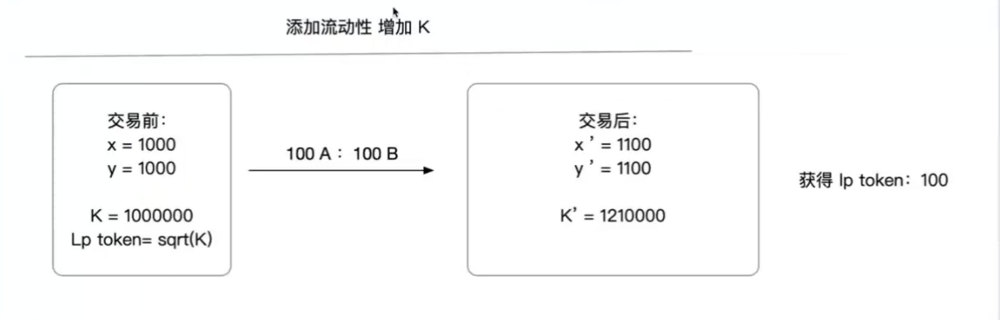
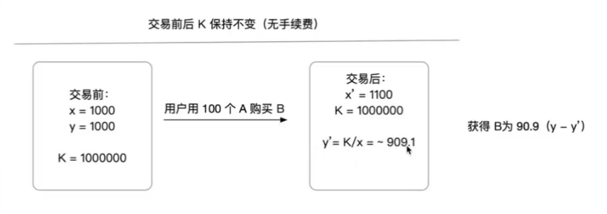
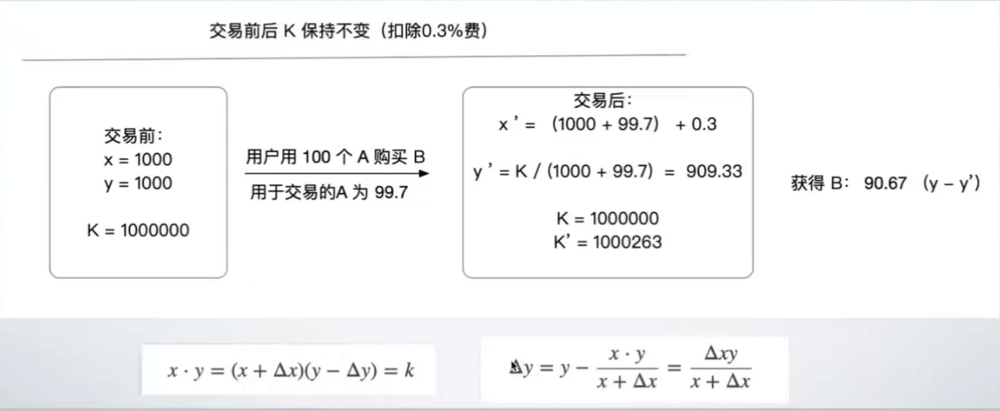
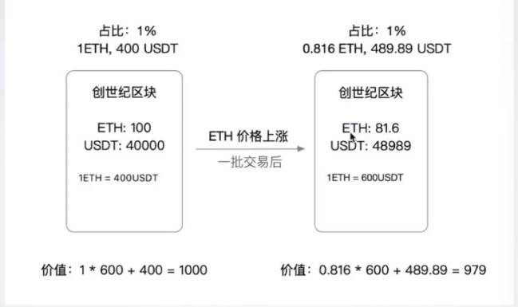
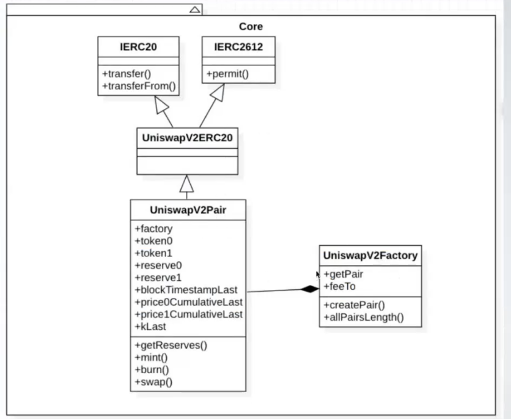
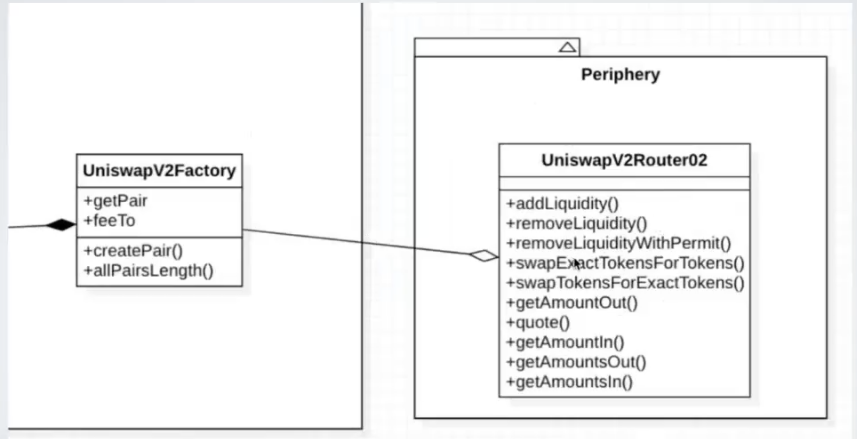

# DEX - 去中心化交易所

### 什么是dex
去中心化交易所(Decentralize Exchange)（Token兑换Token）

交易所订单模型一般分两类：1.订单薄 2.兑换池

订单薄：以0x协议为代表的。链下订单撮合和链上结算
兑换池：以uniswip为代表，自动作市协议

我们将介绍恒定乘积自动做市商（Constant Product Automated Market Maker, CPAMM），它是去中心化交易所的核心机制，被`Uniswap`，`PancakeSwap`等一系列DEX采用。教学合约由`Uniswap-v2`合约简化而来，包括了`CPAMM`最核心的功能。

## 自动做市商

自动做市商（Automated Market Maker，简称 AMM）是一种算法，或者说是一种在区块链上运行的智能合约，它允许数字资产之间的去中心化交易。AMM 的引入开创了一种全新的交易方式，无需传统的买家和卖家进行订单匹配，而是通过一种预设的数学公式（比如，常数乘积公式）创建一个流动性池，使得用户可以随时进行交易。
名词说明：
- Market Maker：做市商(保证订单得以执行)
- 流动性提供者（lp：liquidity providers），提供资产的人以实现快速交易
- 流动性：指如何快速和无缝的购买或出售一项资产

### Uniswap V2

- 常量乘积模型：k = x*y
- AMM的执行引擎，没有价格预言机，价格用公式推导
- x: token0的储备量（reserve0）
- y: token1的储备量（reserve1）
- 提供流动性：
    - 转入token0与token1，增加reserve0，reserve1，拿到流动性凭证（lp token） = sqrt(x*y)
- 兑换时，K保持不变
    - 减少reserve0,jiu必须增加reserve1
- 移除流动性
    - 通过流动性凭证，撤出token0,token1 

流动性添加示意图：

交易前后过程示意图：

价格滑点（slippage）:一次交易使价格改变的程度，单笔交易量越大对价格的影响越大

### Uniswap - 无常损失
流动性提供者无常损失：一对代币存入Uniswap后，如果一种代币以另一种进行计价的价格上升，在价格上升后取出，总价格比原价值低一些，低的部分就是损失。
无常损失示意图：

关于无常损失的更多细节可参考：[https://zhuanlan.zhihu.com/p/268435169](https://zhuanlan.zhihu.com/p/268435169)

### Uniswap代码结构

#### WETH 是Ether的ERC20包装（Wrap-Eth）
Weth合约(WETH9)
[https://etherscan.io/token/0xc02aaa39b223fe8d0a0e5c4f27ead9083c756cc2#code](https://etherscan.io/token/0xc02aaa39b223fe8d0a0e5c4f27ead9083c756cc2#code)