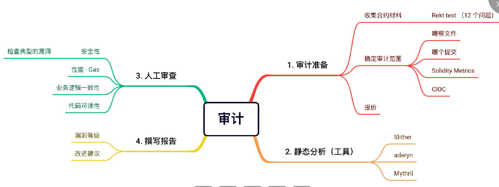
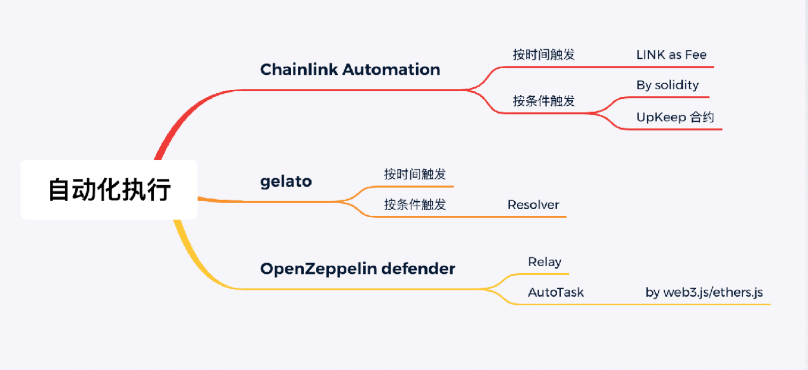

# Contract Acudit 安全审计

## 安全全过程

- 部署前：⽂档、编码、测试、审计
- 运⾏中：监控
- 事故分析
    - 分析资⾦流，尝试定位
    - 迁移

## 合约审计
    
  

## 审计准备

完整的⼯程、详细的⽂档、完备的测试

- Rekt Test: [https://blog.trailofbits.com/2023/08/14/can-you-pass-the-rekt-test/](https://blog.trailofbits.com/2023/08/14/can-you-pass-the-rekt-test/)

### 工具
- CLOC：[https://github.com/AlDanial/cloc](https://github.com/AlDanial/cloc)
- Solidity Metrics (VS Code extensions)
- Solidity Visual developer (VS Code extensions)

## 静态分析

- Slither : [https://github.com/crytic/slither](https://github.com/crytic/slither)
- Aderyn
- [https://mythx.io/](https://mythx.io/)

## ⼈⼯审查

- 熟悉EVM特性、常⻅协议、常⻅安全问题
    - [https://github.com/ZhangZhuoSJTU/Web3Bugs](https://github.com/ZhangZhuoSJTU/Web3Bugs)
- 跟踪安全事件、了解新攻击点
    - [https://substack.com/@blockthreat](https://substack.com/@blockthreat)
    - [https://solodit.xyz/](https://solodit.xyz/)
    - [https://rekt.news/](https://rekt.news/)

## 审计报告

 模板：[https://github.com/Cyfrin/audit-report-templating](https://github.com/Cyfrin/audit-report-templating)

## 运⾏中：监控

OpenZepplin defender Monitor

## 合约⾃动化执⾏

### 如何实现周期任务/定时任务/条件任务？

-  编写后端程序，常驻后端执⾏,但是会遇到诸如：单点故障、热钱包泄漏，的问题

### Chainlink Automation

- 超可靠和去中⼼化的⾃动化平台
- 根据时间或条件⾃动执⾏合约函数
- 若按条件，需编写`Upkeep`合约 
    -  checkUpKeep()
    -  performUpKeep() 

#### ChainLink Automation- 按时间执⾏

- 开发步骤：
- 在 [https://automation.chain.link/](https://automation.chain.link/) 注册
- 选择“Time-based” 
- 填⼊要执⾏的合约地址
- 填⼊时间周期

#### ChainLink Automation - 按条件执⾏

- 编写`UpKeep`合约处理进⾏逻辑判断及调⽤
- `checkUpkeep` (判断条件)
- `performUpkeep`(执⾏)

### Gelato Functions

- 按时间执⾏, ⽆需代码 （automated-transaction）
- 按链上条件执⾏ （Solidity Functions）， checker 合约
- 按链上条件执⾏ （Typescript Functions）

### 事故分析

- [https://phalcon.blocksec.com/explorer](https://phalcon.blocksec.com/explorer)
- [https://www.youtube.com/watch?v=eXeirKUy1XA](https://www.youtube.com/watch?v=eXeirKUy1XA)
- [https://www.youtube.com/watch?v=uiqCrhIU0To](https://www.youtube.com/watch?v=uiqCrhIU0To)
- Foundry Transaction Replay Trace/Debugger 
- Tenderly Debugger

