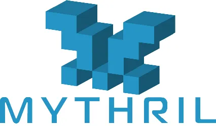

# 智能合约安全工具

在智能合约开发完成以后，除了对智能合约进行必要的测试用例编写和运行以外，为了保障合约的安全性，一般还会经过两个步骤来提升合约的安全性：1.安全工具检测；2.智能合约审计。

下面就是几款智能合约安全工具来查找以太坊智能合约中的安全漏洞。

### 1.Mythril


Mythril 是 EVM 字节码的安全分析工具。它检测为 Ethereum、Hedera、Quorum、Vechain、Roostock、Tron 和其他 EVM 兼容区块链构建的智能合约中的安全漏洞。它使用符号执行、SMT 求解和污点分析来检测各种安全漏洞。它还用于MythX安全分析平台结合使用。

对于Mythril这个工具而言，只能分析单个合约文件，而非整个项目合约文件。

- 安装：
```
pip3 install mythril
```

- 扫描：

```
myth analyze xxx.sol
```
