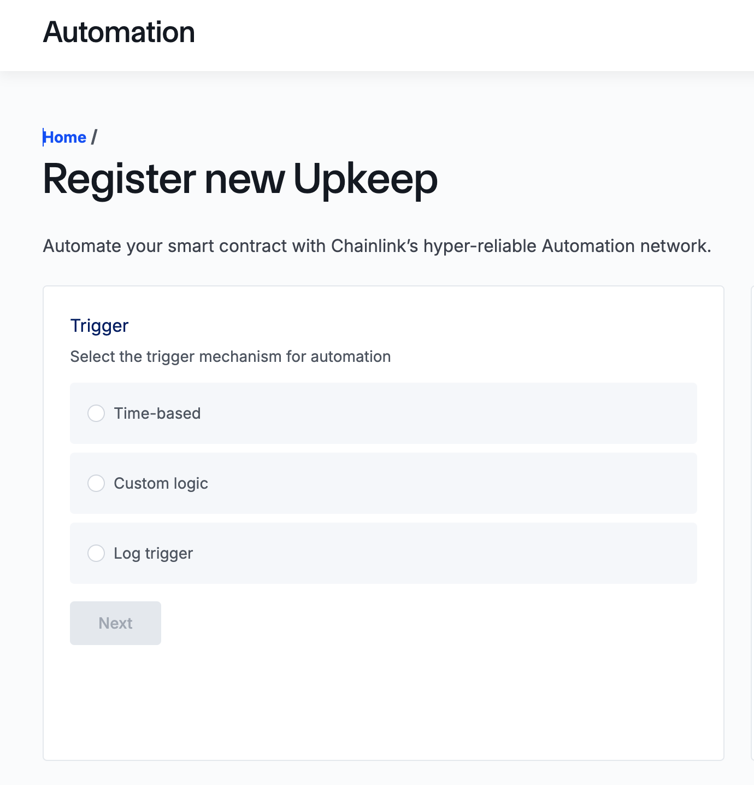
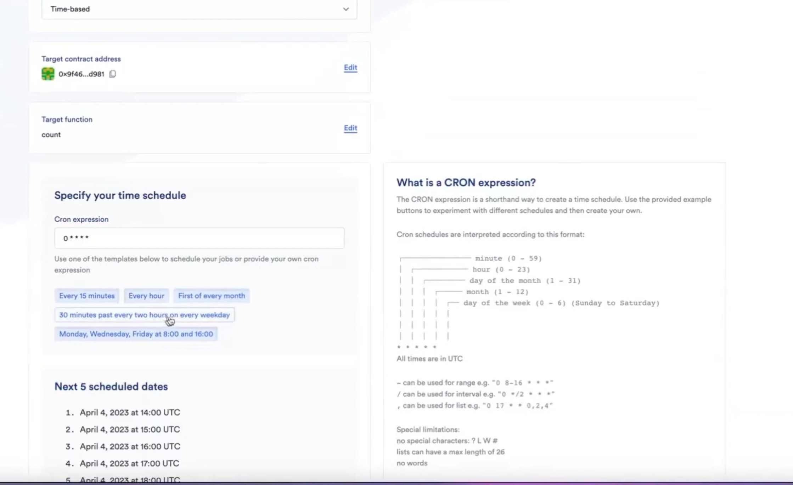
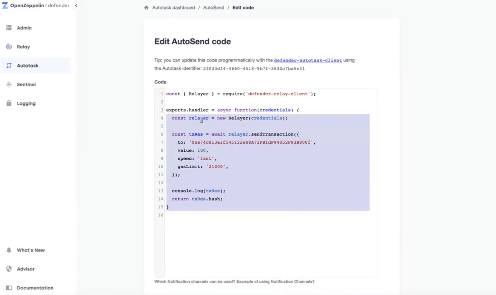

# 自动化执行

### Chainlink Automation
- 按时间触发 
    - Link as Free

- 按条件出发 
    - By solidity
    - UpKeep合约

### gelato （中心化解决方案）

- 按时间出发
- 按条件出发 
    - Resolver 

### OpenZeppelin defender(工具)

-  Relay
-  AutoTask - by web3.js/ethers.js

 ### 智能合约的响应模式
 智能合约只能被动响应即：1.由EOA用户支付gas 2.用户发起一笔交易 3.合约收到调用信息 4.合约执行对应方法
 
 #### 合约自动化执行的问题
 如何实现周期任务、定时任务，条件任务？
 - 编写后端程序，常驻后端执行
     - 主要问题: 单点故障，热钱包泄漏
 
 
### Chainlink Automation
- 超可靠和去中心化的自动化平台
- 根据时间或条件自动执行合约函数
- 若按条件，需编写Upkeep合约
    - checkUpKeep() 链下调用函数，如果返回值是true则调用performUpKeep()
    - performUpKeep()  

#### ChainLink Automation - 按时间执行
- 开发步骤
- 在[https://automation.chain.link/](https://automation.chain.link/)注册
- 选择'Time-base'
- 填入要执行的合约地址
- 填入时间周期    

### ChainLink Automation - 按条件执行
编写UpKeep合约处理进行逻辑判断以及调用
- checkUpKeep（判断条件）
- performUpKeep（执行）

执行流程：链下节点自动执行CheckUpKeep方法，然后根据CheckUpKeep的返回值，如果是True,向Automation Registry中检索对应的合约进行执行。

### Gelato NetWork

- 按时间执行，无需代码
- 按条件执行，编写Resolver
    - `funcation checker() external view returns(bool canExec,bytes memory execPayload)`

官网地址:[https://app.gelato.network/functions](https://app.gelato.network/functions)

### OpenZepplin Defender

- 通过web3.js/ethers.js来定制执行
- Relay：生成独立账户
- AutoTask

官网地址：[https://defender.openzeppelin.com/](https://defender.openzeppelin.com/)

具体图示：