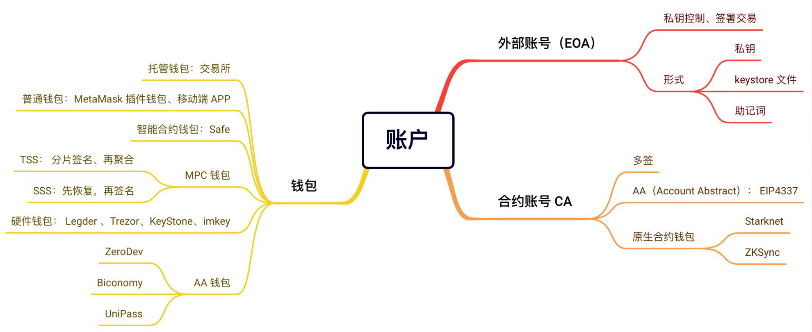
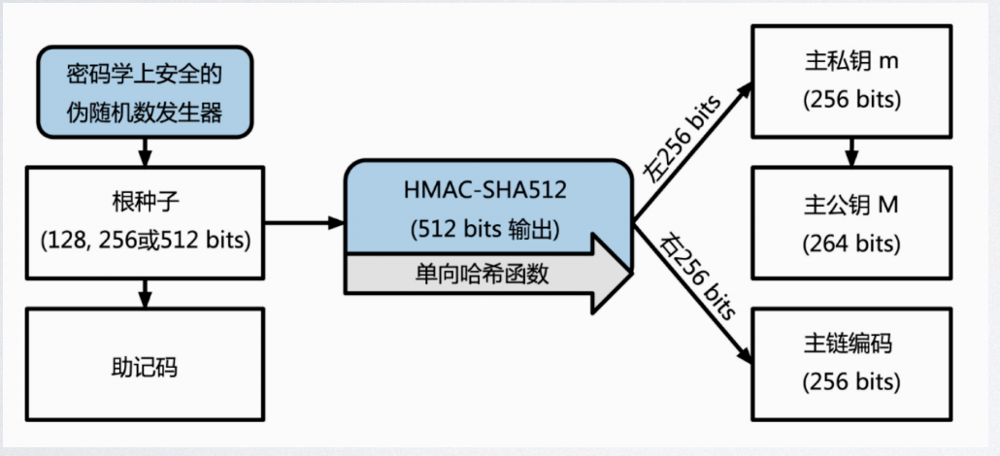

# 钱包相关


钱包包含种类示意图：


## EOA账号

创建`EOA`账号的过程：

- 找到一个安全的熵源（不可预测，不可重复）
- 使用`secp256k1`椭圆曲线算法计算出公钥
- 对公钥进行`keccak256 hash`运算再取后40位得到 


### 分层确定性推导
随机生成的私钥，备份麻烦，不易管理，因此采用的解决办法是，分层确定性推导。

- `BIP32`提案(HD钱包`Hierarchical Deterministic`):由同⼀个种⼦，就可以⽣成⽆数个私钥
和地址

- `BIP44` 提案: 给`bip32`的路径赋予意义来⽀持做多币种、多地址
- `BIP39`: 使⽤助记词的⽅式，⽣成种⼦


关于种子推导生成密钥可参考：
[https://learnblockchain.cn/2018/09/28/hdwallet/](https://learnblockchain.cn/2018/09/28/hdwallet/)


`BIP44`参考文章：[https://github.com/satoshilabs/slips/blob/master/slip-0044.md](https://github.com/satoshilabs/slips/blob/master/slip-0044.md)


### BIP32
一个种子生成多个私钥的示意图：




#### 说明与解释：
- 第一步推导主秘钥的过程：
    根种子输入到`HMAC-SHA512`算法中就可以得到一个可用来创造主私钥(m) 和 一个主链编码（a master chain code)这一步生成的秘钥（由私钥或公钥）及主链编码再加上一个索引号    
- 第二步推导子密钥：
    将作为`HMAC-SHA512`算法的输入继续衍生出下一层的私钥及链编码。因此增加索引（水平扩展）及 通过子秘钥向下一层（深度扩展）可以无限生成私钥。

**注意：**衍生推导的方案其实有两个：一个用父私钥推导（称为强化衍生方程），一个用父公钥推导。同时为了区分这两种不同的衍生，在索引号也进行了区分，索引号小于`2^31`用于常规衍生，而`2^31`到`2^32-1`之间用于强化衍生，为了方便表示索引号`i'`，表示`2^31+i`。

**注意：**这个推导过程是确定（相同的输入，总是有相同的输出）也是单向的，子密钥不能推导出同层级的兄弟密钥，也不能推出父密钥。如果没有子链码也不能推导出孙密钥。


详细内容参考内容：[https://learnblockchain.cn/article/2131](https://learnblockchain.cn/article/2131)

### 秘钥路径及BIP44 

#### 秘钥路径
通过这种分层（树状结构）推导出来的秘钥，通常用路径来表示，每个级别之间用斜杠`/` 来表示，由主私钥衍生出的私钥起始以`“m”`打头。因此，第一个母密钥生成的子私钥是`m/0`。第一个公共钥匙是`M/0`。第一个子密钥的子密钥就是`m/0/1`，以此类推。

### BIP44
`BIP44`是为这个路径约定了一个规范的含义(也扩展了对多币种的支持)，`BIP0044`指定了包含`5`个预定义树状层级的结构：
`m / purpose' / coin' / account' / change / address_index`

#### 结构说明
- `m`: 固定的值
- `Purpose`: 是固定的值，值为`44`（或者 0x8000002C）
- `Coin type`: 这个代表的是币种，`0`代表比特币，`1`代表比特币测试链，`60`代表以太坊，完整的币种列表地址：[https://github.com/satoshilabs/slips/blob/master/slip-0044.md](https://github.com/satoshilabs/slips/blob/master/slip-0044.md)
- `Account`: 代表这个币的账户索引，从`0`开始,代表生成第几个地址，官方建议，每个`account`下的`address_index`不要超过`20`.根据 [EIP85提议的讨论](https://github.com/ethereum/EIPs/issues/85)以太坊钱包也遵循`BIP44`标准，确定路径是`m/44'/60'/a'/0/n`。 `a`表示帐号，`n` 是第`n`生成的地址，`60` 是在 [SLIP44 提案](https://github.com/satoshilabs/slips/blob/master/slip-0044.md)中确定的以太坊的编码。


**注意：**可以通过如下链接来体验钱包以及地址的生成：[https://chaintool.tech/generateWallet/evmWallet](https://chaintool.tech/generateWallet/evmWallet)

### BIP39

生成过程示意图：


`BIP32`提案可以让我们保存一个随机数种子（通常16进制数表示），而不是一堆秘钥，不过用户使用起来(比如冷备份)也比较繁琐，这就出现了[BIP39](https://github.com/bitcoin/bips/blob/master/bip-0039.mediawiki)，它是使用助记词的方式，生成种子的，这样用户只需要记住12（或24）个单词，单词序列通过`PBKDF2`与`HMAC-SHA512`函数创建出随机种子作为`BIP32`的种子。

简单的对比：

```
// 随机数种子
090ABCB3A6e1400e9345bC60c78a8BE7
// 助记词种子
candy maple cake sugar pudding cream honey rich smooth crumble sweet treat

```

参考资料：[https://github.com/bitcoin/bips/blob/master/bip-0039.mediawiki](https://github.com/bitcoin/bips/blob/master/bip-0039.mediawiki)
[https://github.com/bitcoinjs/bip39](https://github.com/bitcoinjs/bip39)


### 智能合约钱包

- 外部账户（EOA）与合约账户在EVM层面是等效的，都有：nonce(交易序号),balance(余额),storageRoot(状态),codeHash(代码)
- 如果该合约可以持有资金，调用任意合约方法，就是一个智能合约钱包账户
- `ERC4337`: 抽象EOA与智能合约的区别

 **注意：**关于`ERC4337`的更多内容可参考：[https://learnblockchain.cn/article/5442](https://learnblockchain.cn/article/5442)

关于智能合约可以签名的操作可参考如下文章：[https://learnblockchain.cn/article/7893](https://learnblockchain.cn/article/7893)

